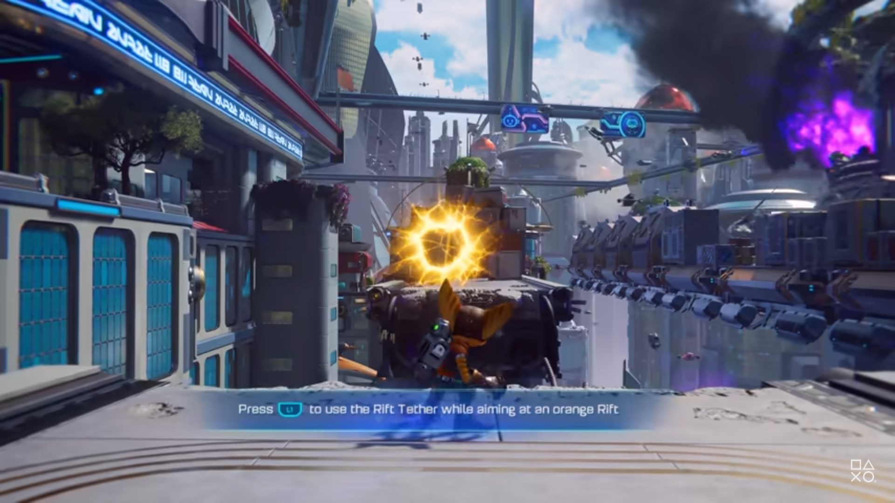
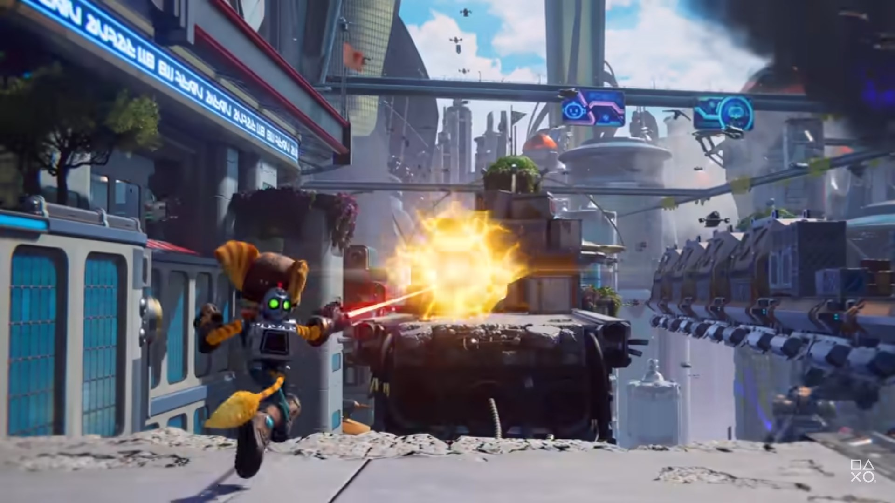
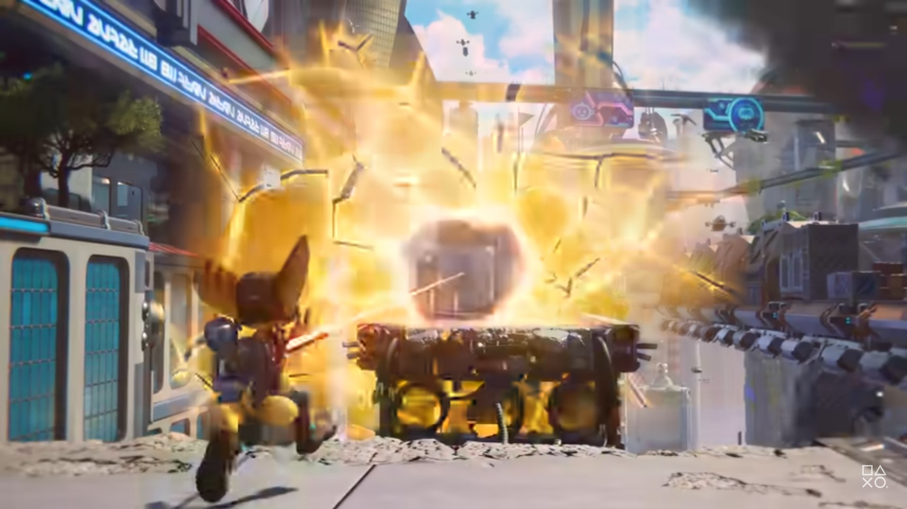
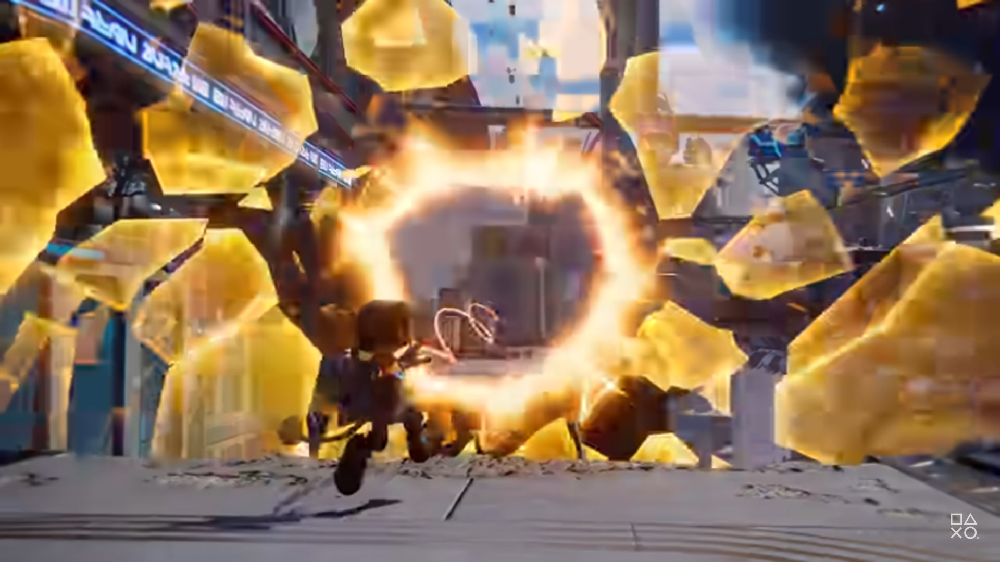
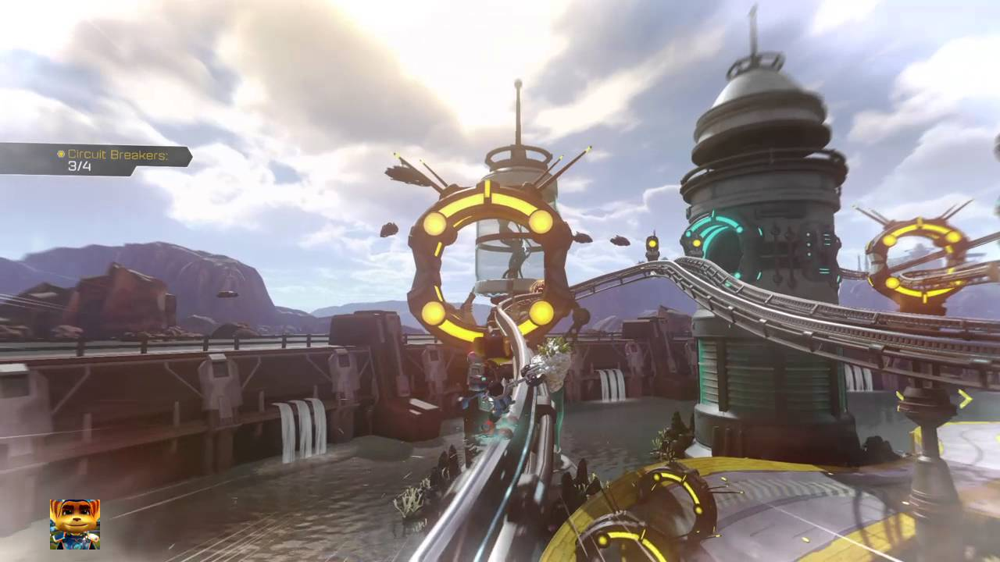
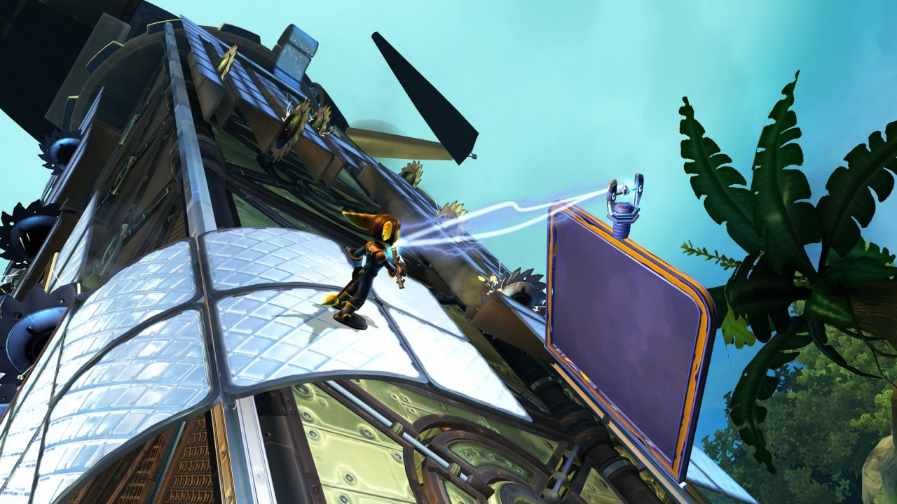

# HMIN317 Moteur de jeux - Project Sheet

## Base Concepts

My intent with this project is to create a general 3D Game Engine.
The main features will be:
* **Entity Component and Entity Component System (EC/ECS)** patterns
* **Asset & Scene management** with acceleration structures (Octree, BVH, )
* **C# Scripting** implemented with the *Mono* managed code
* **Standard PBR rendering** using *Vulkan*
* **Editor Interface**, whether with *dear imGui* or *Qt*

The features I will **not** cover in this project, except if I have extra time (I won't)
* **Networking Layer & High level API** with authorative server and prediction

## Demo Concept & Gameplay

I was really astounded by the new [Ratcher & Clank: Rift Apart - Gameplay Demo 🔗](https://www.youtube.com/watch?v=GffelVJeGws)

I really like the new *Rift Traversal* mechanics shown at [`2:50` 🔗](https://www.youtube.com/watch?v=GffelVJeGws&t=170s) of the gameplay demo.

My goal would be to reproduce this effect in a little 3D platformer demo scene, and add some little mechanics of Ratcher & Clanks that I find interesting study.

### Rift Traversal

| 1 | 2 | 3 | 4 |
|-----------------------------|----------------------------| ----------------------------|-------------------------|
|  | |  |  |

The system is a bit similar to **Portal**'s portals.
The difference is that we pull the rendering plan to the player, and perform a smooth teleportation to te target location.

I will make a technical breakdown for this effect.

### Rails

Rails are quite common, they use a spline to move the character along them. The results are smooth and very pleasant.

I already made a [rail-shooter prototype 🔗](https://noe.masse.pro/videos/space-shooter.mp4).

### Gravity Boots

Gravity boots are another cool mechanics that plays with the gravity to make ratchet able to move on surfaces with a different local frame.

## Rendering 

For the rendering tech, I choose to use Vulkan as I already master OpenGL. If the task is too heavy, I'll switch back to OpenGL.

Rendering features I plan to implement:
* **PBR** Physically Basically Rendering following GLTF's standards
* **Frame Graphs (or Post Processing Stack)** Controls the way your frame is rendered, makes you able to go with Forward, Deferred or Forward+ rendering
* **Reflection Probes**

And If I have time to add more:
* **Light Probes** usinh *Spherical Harmonics*
* **Path Tracer** to compare results and get some cool screenshots !
* **Plenty of other techniques** SSAO, SSR, HDR...

## Resources

* [Entity Component System in C++, Qt, OpenGL and CUDA (FR) 🔗](http://guillaume.belz.free.fr/doku.php?id=ecs)
* [Vulkan Development 🔗](https://vulkan-tutorial.com/)
* [Embedding Mono 🔗](https://www.mono-project.com/docs/advanced/embedding/) *(with an [example 🔗](https://gist.github.com/zwcloud/b342d264176ee2143aca970a9933e5cc))*
* [3D-Sea Engine 🔗](https://github.com/Eikins/3D-Sea-Project) for base architecture and OpenGL rendering
* [Game Programming Patterns 📖](https://gameprogrammingpatterns.com/)
* [Mixamo 🕺 🔗](https://www.mixamo.com/)
* My GameDev lectures