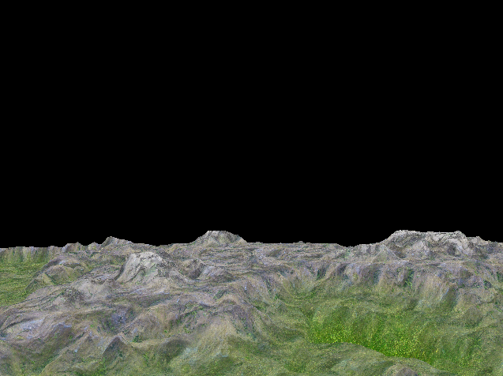
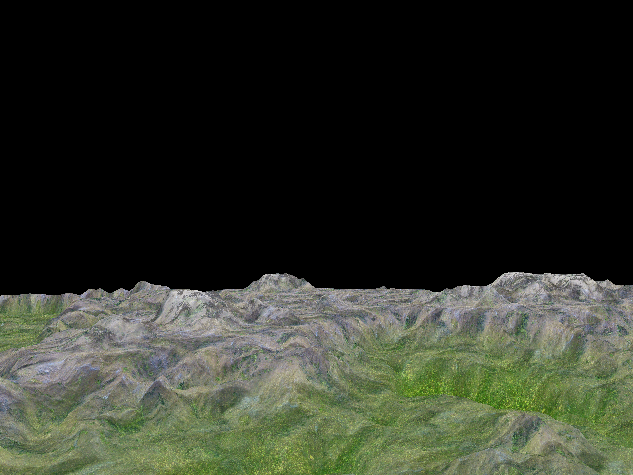
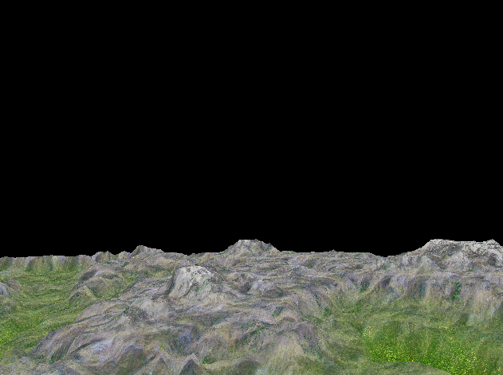
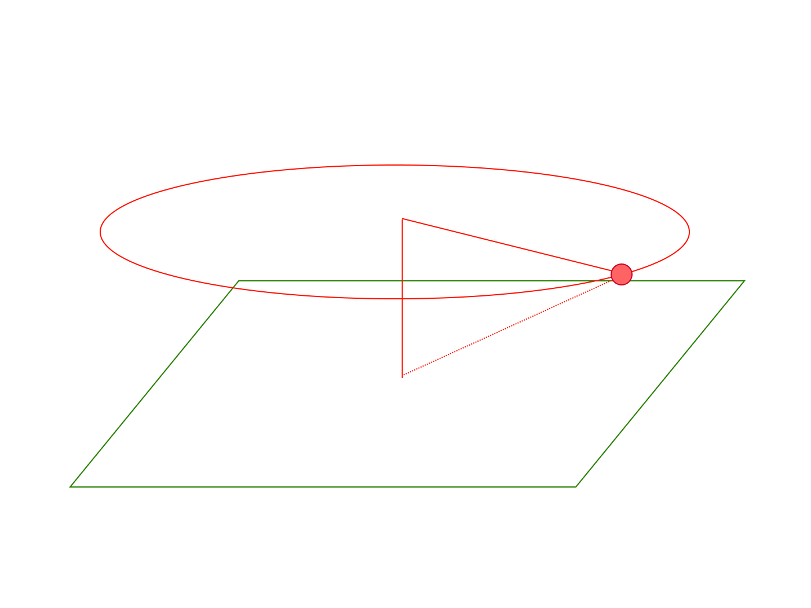
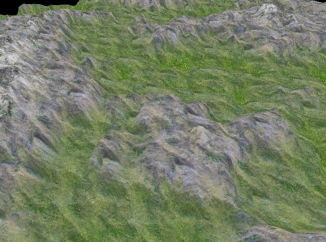
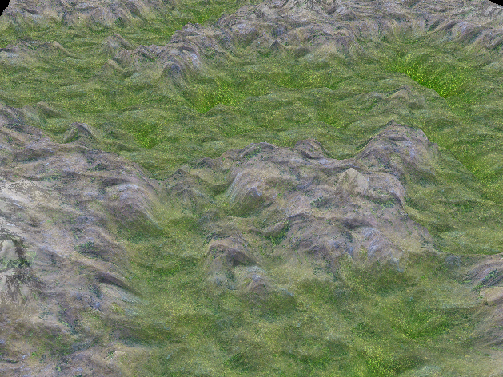

# HMIN 317 - Moteurs de Jeux : Prise en main de Qt Creator, Git et OpenGL ES 3.0

## Transformations

Un `Objet 3D` doit pourvoir subir différentes opérations mathématiques pour pouvoir le positionner et orienter dans l'espace.
Pour se faire, on utilise les **matrices de transformations**.

Les trois transformations nécessaires pour représenter un objet sont :
* Les translations $T$
* Les rotations $R$
* Les homothéties $S$

La multiplication de matrices est l'équvalent de la composition des transformations, nous pouvons donc définir une matrice représentant la transformation de notre objet (Model Matrix $M$).

$$M = T \times R \times S$$

Pour simplifier les usages, nous ne travaillons pas directement avec des matrices, mais avec des objets plus simples représentant ces transformations qui seront convertis en matrices.

Sous Qt, nous avons les éléments suivants :

* Les matrices sont représentées par des `QMatrix4x4`
* Les translations et homothéties sont représentée par des `QVector3D`
* Les rotations sont représentées par des `QQuaternion`

On peut donc par exemple, appliquer une transformation à notre objet
```C++
QMatrix4x4 transform;
QVector3 translation = QVector3(0.0, 0.0, -5.0);
// Rotation of 45° around Y
QQuaternion rotation = QQuaternion::fromAxisAndAngle(QVector3(0, 1, 0), 45.0);
QVector3 scale = QVector3(2.0, 1.0, 2.0);

transform.translate(translation);
transform.rotate(rotation);
transform.scale(scale);
```

*Pour la 2D, il existe l'équivalent [`QTransform` 🔗](https://doc.qt.io/qt-5/qtransform.html#details)*

## Dessin en 3D

Pour dessiner des objets sur l'écran, on utilise ici une surcouche d'**OpenGL**.
On crée des `QOpenGLBuffer` pour définir nos VBOs.

Notre code de rendu ira dans la méthode `paintGL` de la classe `MainWidget`.

➡️[QOpenGLWidget Documentation 🔗](https://doc.qt.io/qt-5.9/qopenglwidget.html)

## Gestion des Inputs

Pour gérer les entrées utilisateurs, on utilise les callbacks fournis par la classe `QWidget`.

➡️[QWidget Event Callbacks 🔗](https://doc.qt.io/qt-5/qwidget.html#protected-functions)

## Génération de terrain avec une Heightmap

### Génération d'un plan subdivisé

La première étape consiste à générer un plan subdivisé sur lequel nous allons ensuite modifier la hauteur des sommets.

Pour se faire, nous utilisons un [Triangle Strip 🔗](https://en.wikipedia.org/wiki/Triangle_strip).

*Une autre méthode est d'utiliser des éléments, mais moins optimal.   [`Mesh.Plane` 🔗](https://github.com/Eikins/3D-Sea-Project/blob/master/sea3d/core/mesh.py#L118)*

#### Implémentation
➡️ [geometryengine.cpp::generatePlaneGeometry🔗](https://github.com/Eikins/M2-Imagina/blob/master/HMIN317/TP%201-2/QtProject/geometryengine.cpp#L83)

On modifie la hauteur des vertices au runtime.
On applique ensuite une texture en fonction de la hauteur.  
On travaille toujours dans l'*Object Space* pour rester indépendant des transformations appliquées au terrain.
#### terrain_vertex.glsl
```GLSL
void main()
{
    v_texCoord0 = texCoord0;

    vec4 pos = vec4(position, 1.0);
    // Terrain height displacement
    pos.y += texture2D(_HeightMap, texCoord0).r * MAX_HEIGHT;
    v_osPos = pos.xyz;

    gl_Position = ObjectToClip(pos);
}
```
#### terrain_fragment.glsl
```GLSL
void main()
{
    vec3 color;
    vec3 rockColor = texture2D(_RockTexMap, v_texCoord0 * 10).xyz;
    if (v_osPos.y > ROCK_HEIGHT)
    {
        vec3 snowrockColor = texture2D(_SnowrockTexMap, v_texCoord0 * 10).xyz;
        color = mix(rockColor, snowrockColor, (v_osPos.y - ROCK_HEIGHT) / (SNOW_HEIGHT - ROCK_HEIGHT));
    }
    else
    {
        vec3 grassColor = texture2D(_GrassTexMap, v_texCoord0 * 10).xyz;
        color = mix(grassColor, rockColor, (v_osPos.y - GRASS_HEIGHT) / (ROCK_HEIGHT - GRASS_HEIGHT));
    }

    gl_FragColor = vec4(color, 1.0);
}
```

#### Résultat


## Gestion de la Caméra

Pour calculer les coordonnées dans le *Clip Space* des objets, on utilises deux matrices définis par notre caméra.

$$MVP = P \times V \times M$$

| Matrice | Nom        | Transformation                     |
| ------- | ---------- | ---------------------------------- |
| $M$     | Model      | *Object Space* $\to$ *World Space* |
| $V$     | Vue        | *World Space* $\to$ *View Space*   |
| $P$     | Projection | *View Space* $\to$ *Clip Space*    |

*Note: Si on souhaite définir la caméra comme un objet de la scène, on a alors la propriété: $V_{Cam} = M_{Cam}^{-1}$.  
On ajoutera aussi que définir une homothétie pour une caméra n'a pas de sens,
$M_{Cam} = T_{Cam} \times R_{Cam}$. Ce qui nous donne facilement $V_{Cam}$.*

$$V_{Cam} = (R_{Cam})^T \times (T_{Cam})^{-1}$$


### Déplacement de la caméra à hauteur du terrain
Pour se faire, il suffit de récupérer la position de la caméra dans l'*Object Space* du terrain et de sampler la hauteur de celle ci. Cette opération peut se faire au vertex shader, tout comme du côté du CPU.

Ici, on simplifie car on sait que notre terrain n'a aucune transformation, on utilise donc directement la position *World Space* de la caméra.

#### terrain_vertex.glsl
```GLSL
void main()
{
    v_texCoord0 = texCoord0;

    vec4 pos = vec4(position, 1.0);
    // Terrain height
    pos.y += texture2D(_HeightMap, texCoord0).r * MAX_HEIGHT;
    v_osPos = pos.xyz;

    // If we want to support terrain transforms, then we need
    // the inverse model (mat_ObjectToWorld_I) of the terrain
    // and then transform the cam_Position
    float camHeight = texture2D(_HeightMap, cam_Position.xz).r * MAX_HEIGHT;
    pos.y -= camHeight;

    gl_Position = ObjectToClip(pos);
}
```
||||
|-|-|-|
|  |  |  |

### Caméra rotative

On peut faire tourner la caméra autour du point $O$ avec un angle de 45°.



Pour se faire, on définit une distance $D$ au centre.
On définit une vitesse $v$ en unité par seconde.

On obtient aisément:  
$d = \frac{D}{\sqrt{2}}$, 
$\omega = \frac{d\theta}{dt} = \frac{v}{d}$  
$x = d \cos(\theta)$  
$y = d$  
$z = d \sin(\theta)$

Pour l'orientation, on utilise simplement la méthode `lookAt`.

```C++
    _cameraAngle += _cameraSpeed * 0.016 / _cameraDistance;
    if (_cameraAngle > TAU) _cameraAngle -= TAU;
    QVector3D camPos(
        _cameraDistance * cos(_cameraAngle),
        _cameraDistance,
        _cameraDistance * sin(_cameraAngle)
    );

    QVector3D camUp(camPos);
    camUp.setX(-camUp.x());
    camUp.setZ(-camUp.z());

    // LookAt method directly gives inverted matrix
    // This is not optimal because we work with the camera
    // model and we need to invert it again.
    // But we don't care about perfs for now.
    QMatrix4x4 lookAtMat;
    lookAtMat.lookAt(camPos, QVector3D(0.0F, 0.0F, 0.0F), camUp);
    view = lookAtMat.inverted();

    update();
```

|||
|-|-|
|  |  

## Taux de rafraîchissements

Jusqu'à maintenant, on définissait la vitesse indépendant du framerate et tu temps écoulé entre deux frames.

Cela veut donc dire que notre jeux serait ralentit si le framerate est bas.  
C'est ce que l'on observe si on compare 4 fenêtres avec des fréquences différentes.

Certains jeux de combats restent frame-dependent, car on essaye de donner au joueur un feedback constant par rapport à ses inputs et ce qu'il observe, mais ce n'est pas convenable pour la plupart des jeux.

La solution d'utiliser la [Méthode des différences finies 🔗](https://fr.wikipedia.org/wiki/M%C3%A9thode_des_diff%C3%A9rences_finies).  
On échantillone notre espace de temps en calculant le temps écoulé entre deux frames, souvent dénomé `deltaTime`.  
Grâce à ça, on peut résoudre les équations de déplacements de notre caméra correctement.

*Note: Contrairement à une simulation, on est obligé d'utiliser un schéma explicite (qui utilise des valeurs de temps passées uniquement), cela qui un problème au niveau de la convergence de la solution, mais ce n'est pas un problème pour les jeux.  
C'est d'ailleurs aussi la discretisation qui crée les bugs de non détection de collisions lorsque la vitesse des objets est trop élevées.*

