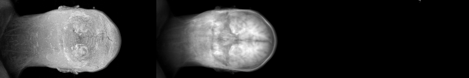
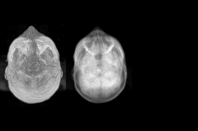
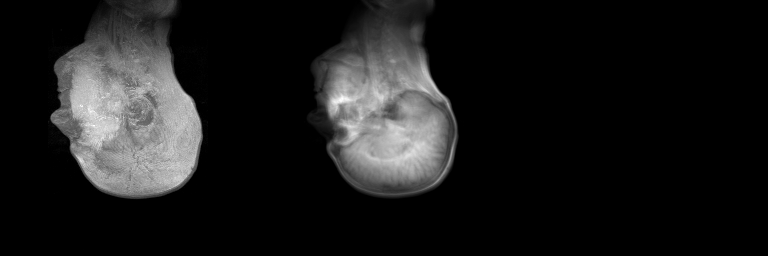
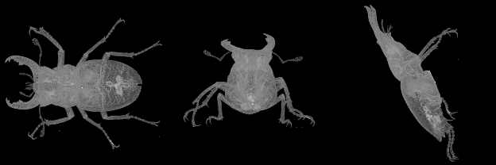

# HMIN318 Imagerie médicale et 3D - Lecture, stockage d'images 3D et visualisation volumique

Auteur: Noé Masse

## Lecture et stockage d'images 3D

Pour lire et sauvegarder une image 3D, il faut utiliser la classe `Image3D` de la lib `MedicalImage`.

Le nom de l'image doit correspondre au format suivant
```
{NOM}.{Width}x{Height}x{Depth}.{VoxelX}x{VoxelY}x{VoxelZ}.img
```

Où `Width`, `Height` et `Depth` sont les dimensions de l'image, et `VoxelX`, `VoxelY` et `VoxelZ` les dimensions d'un voxel.

Exemple
```
t1-head.256x256x129.1.5x1.5x1.5.img
```

Une fois ceci fait, il suffit d'appeler le constructeur avec le nom de notre image.

```C++
#include "Image3D.h"

...

MedicalImage::Image3D image("resources\\t1-head.256x256x129.1.5x1.5x1.5.img");
// Read or write voxel at coords (x, y, z)
image(131, 157, 48) = 0;
// Save the image
image.Save("results\\modified-t1-head.img");
```

## Rendu Volumique

Afin de pourvoir examiner les données, on peut générer le rendu volumique `MIP`, `AIP` ou `MinIP` suivant les axes `X`, `Y` et `Z`.

```C++
MedicalImage::Image3D volumeRenderImage = image.ComputeVisualisation(
    /* Axis */ MedicalImage::X,
    /* Mode */ MedicalImage::MIP);
```

## Résultats

Résultats pour l'image *t1-head*:

### MIP, AIP et MinIP suivant $\vec{x}$


### MIP, AIP et MinIP suivant $\vec{y}$


### MIP, AIP et MinIP suivant $\vec{z}$


## Bonus : Résultats du secret bien gardé

Grâce au rendu volumique, l'image secrète est révélée et nous nous apercevons que c'est un scarabée 🐞

