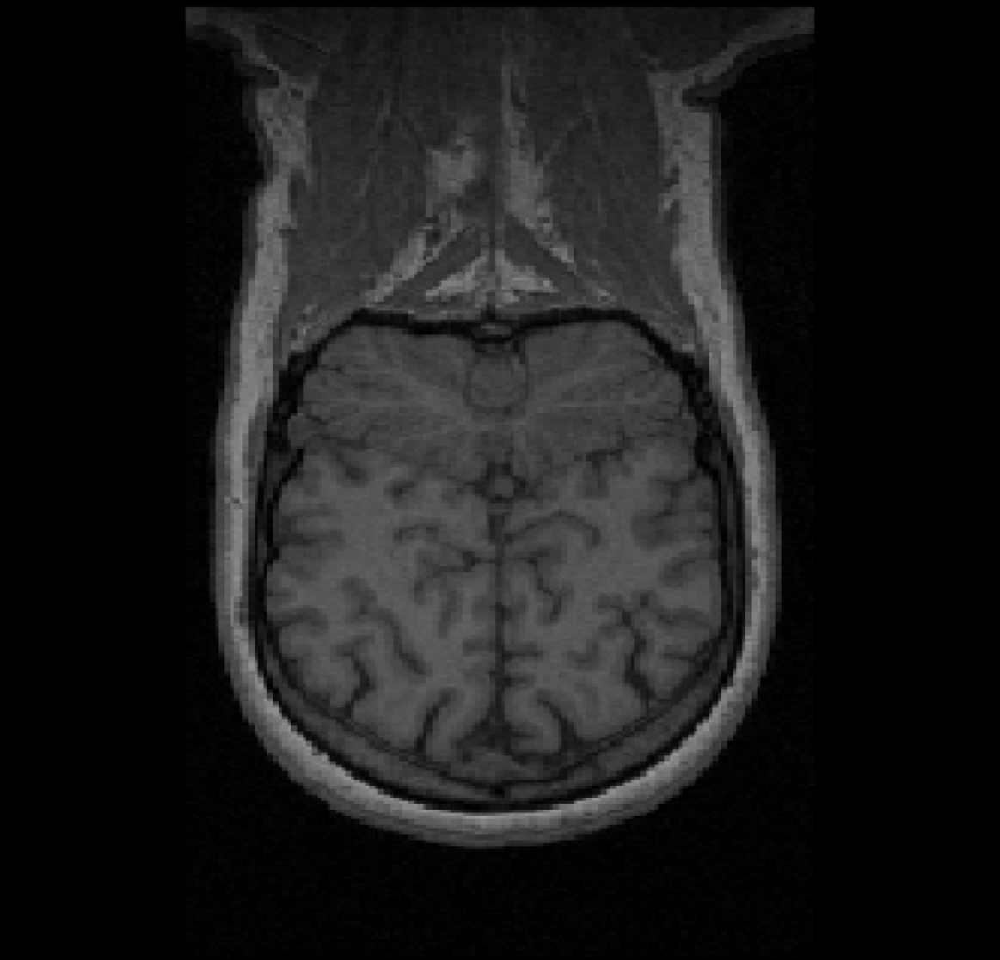
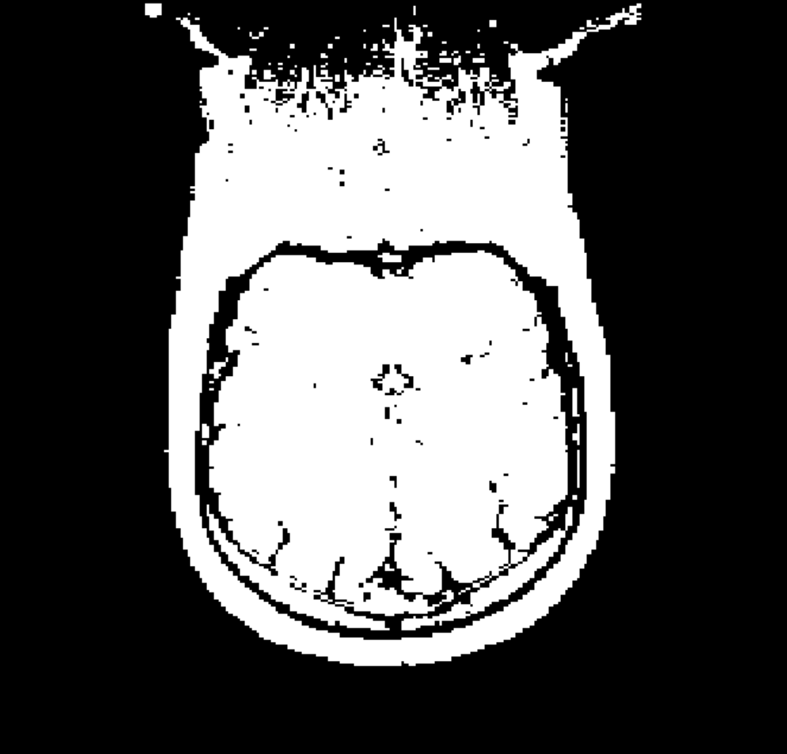
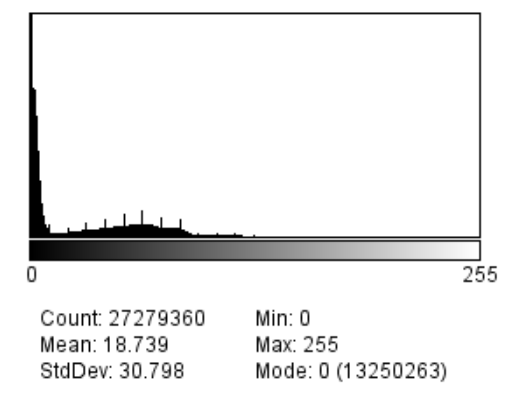
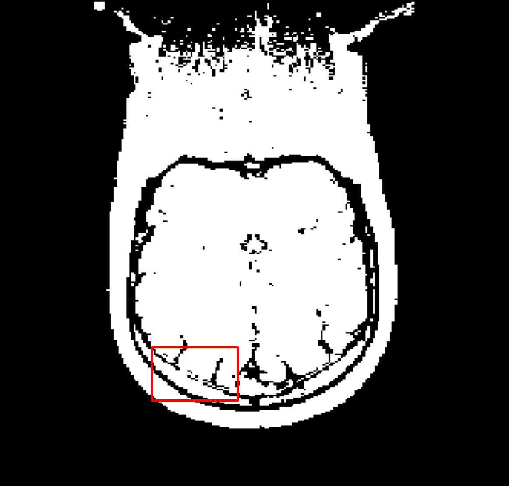
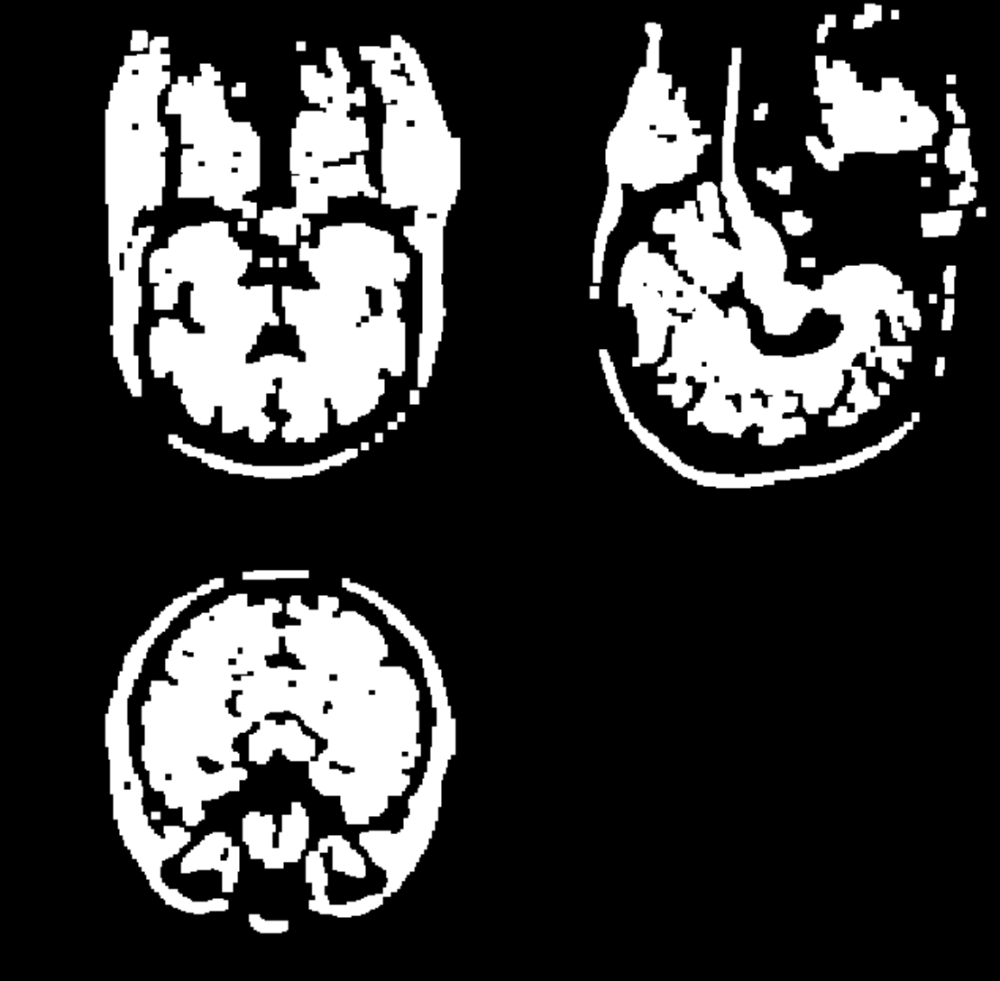
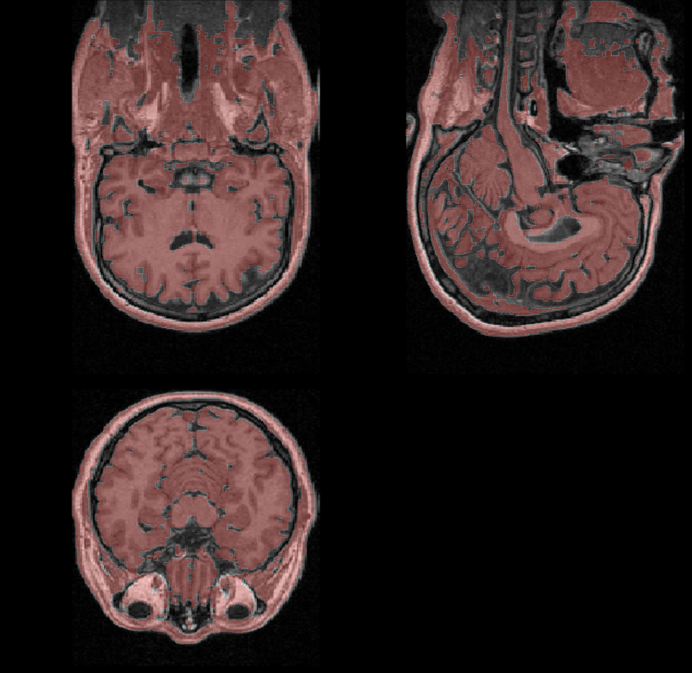
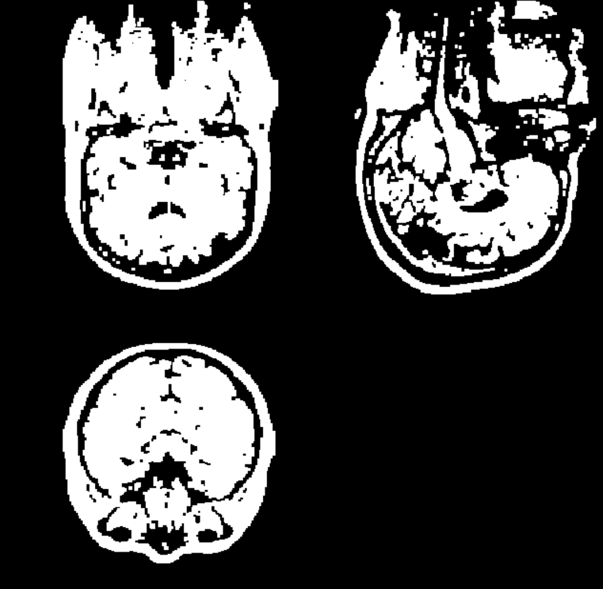
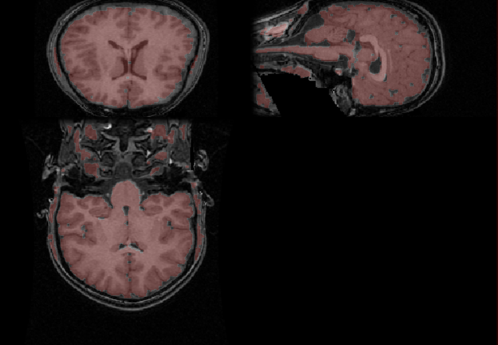
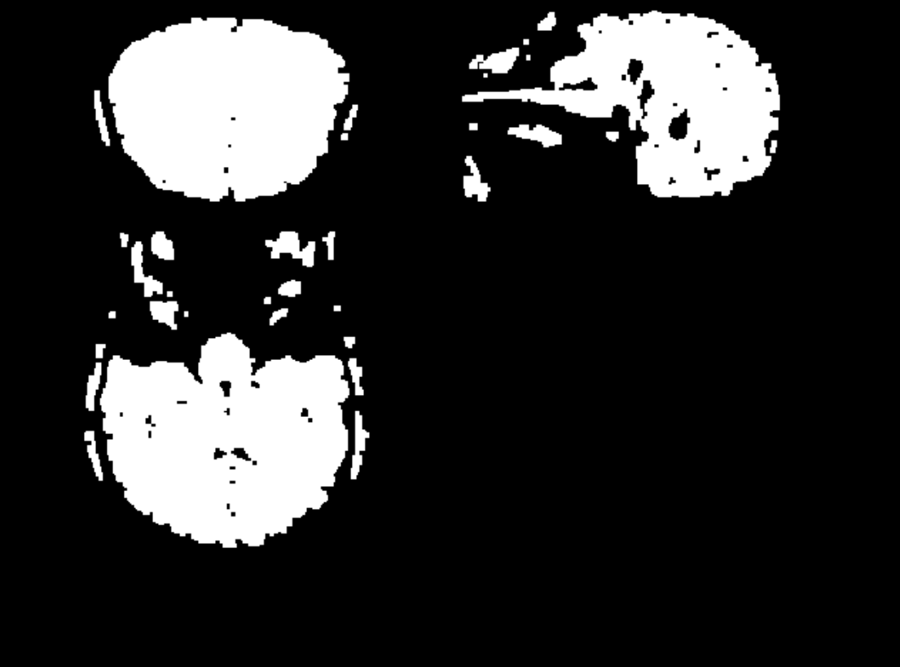

# HMIN318M Imagerie Médicale et 3D
*Noé Masse, 27/09/2020*

## Segmentation

Notre objectif va être d'implémenter un algorithme de segmentation appelé *Bridge Burner*, proposé par *A. Mikheev, H. Rusinek et R. Grossman*.

Le principe est le suivant :
* Binariser l'image
* Eroder l'image avec plusieurs passes
* Dilater l'image sur les pixels érodé

Cela est similaire à l'opérateur *Opening*, qui est définit comme la dilatation d'une érosion. Cet opérateur a la propriété d'enlever les connections *(bridges)* entres ilôts.

Pour plus d'information sur les opérateurs morphologique, voir :  
*"Image analysis using mathematical morphology", R. M. Haralick, S. R. Sternberg, and X. Zhuang, IEEE*

Vous pouvez aussi jeter un oeil à un travail similaire réalisé sur des [empreintes digitales 🔗](https://noe.masse.pro/files/Fingerprint-Presentation.pdf) (Slide 21).

## Analyse d'un cerveau

On possède l'acquisition d'un cerveau, et on utilise [Fiji 🔗](https://fiji.sc/) afin de l'analyser.

| Original | Binarized (Otsu) |
|-|-|
| | |

| Histogramme |
|-|
|  |

### Seuillage

Afin de binariser l'image, on utilise la [Méthode d'Otsu 🔗](https://fr.wikipedia.org/wiki/M%C3%A9thode_d%27Otsu).  
Celle ci nous deux classes de manière à minimiser les variances.  
Pour l'image 3D Coronal, on obtient un seuil de **36**.

Cependant, cela ne suffit pas, en effet, si on observe bien, on peut voir des connections entre les différentes parties.



C'est là qu'intervient l'algorithme *Bridge Burner*.

## Implémentation

Une première version est très rapide à implémenter.  
On choisi une taille de masque uniforme de 2x2x2, on prend le plus petit possible, car on préférera ici jouer sur le nombre d'opération successives.
```C++
CImg<unsigned short> binarizedImg = img.get_threshold(threshold);

for (int i = 0; i < erodeCount; i++)
{
    binarizedImg.erode(2);
}

for (int i = 0; i < dilateCount; i++)
{
    binarizedImg.dilate(2);
}
```

Avec les paramètres suivants
| threshold | erodeCount | dilateCount |
| --------- | ---------- | ----------- |
|        36 |          3 |           2 |

On obtient le résultat suivant:



## Seuillage Automatique

Pour le seuil de binarisation, on utilisera quasiment systématiquement la méthode d'Otsu. 

*Le code est adapté de mon ancien travail cité précédemment : [binarizer.cpp (gitlab.com) 🔗](https://gitlab.com/carlosbb/fingerprint/-/blob/develop/src/img/morph/filters/binarizer.cpp)*

```C++
unsigned short GetOtsuThreshold(const CImg<unsigned short> &img)
{
    // Calculate the threshold using the method:
    // A threshold selection method from gray-level histograms,
    // N. Otsu, 1975, Automatica

    double mean   = 0.0;
    double expect = 0.0; // mu
    double cumul  = 0.0; // omega
    double maxVar = 0.0; // sigma_B

    // C6262: Use the heap, too much data for the stack
    std::vector<double> hist(USHRT_MAX, 0.0F);

    unsigned int voxelCount = img.size();
    unsigned short threshold = 0;

    // ==== Compute hist ====
    cimg_for(img, ptr, unsigned short)
    {
        hist[*ptr]++;
    }

    for (int i = 0; i < USHRT_MAX; i++) {
        hist[i] /= voxelCount;
        mean += i * hist[i];
    }

    // ==== Threshold ====
    for (int i = 0; i < USHRT_MAX; i++) {
        cumul += hist[i];
        expect += i * hist[i];

        if (cumul >= 1.0) break;

        double var = std::pow(mean * cumul - expect, 2) / (cumul * (1 - cumul));

        if (var >= maxVar) {
            threshold = i;
            maxVar = var;
        }
    }

    return threshold;
}
```

## Résultats

On obtient des résultats plutôt bon sur l'image *brainseg*, un peu moins bon sur l'image *Coronal*.

### Coronal

| Segmentée | Masque |
| --------- | ------ |
|| |

### Brainseg

| Segmentée | Masque |
| --------- | ------ |
|| |

## Pistes de réflexion

Il serait intéressant de se pencher sur les opérateurs morphologiques généralisés (non binaire), 
proposé par *Haralick, Sternberg* et *Zhuang*.
Une idée que j'aurais pour éliminer les *bridges*, serait de calculer une *Distance Transform*, et la binariser avec un seuil choisi, et ensuite dilater l'image. 

# Annexe

### TP2.cpp
```C++
#include <iostream>
#include <cmath>
#include <vector>

#include "CImg.h"

using namespace cimg_library;

unsigned short GetOtsuThreshold(const CImg<unsigned short> &img)
{
    // Calculate the threshold using the method:
    // A threshold selection method from gray-level histograms,
    // N. Otsu, 1975, Automatica

    double mean   = 0.0;
    double expect = 0.0; // mu
    double cumul  = 0.0; // omega
    double maxVar = 0.0; // sigma_B

    // C6262: Use the heap, too much data for the stack
    std::vector<double> hist(USHRT_MAX, 0.0F);

    unsigned int voxelCount = img.size();
    unsigned short threshold = 0;

    // ==== Compute hist ====
    cimg_for(img, ptr, unsigned short)
    {
        hist[*ptr]++;
    }

    for (int i = 0; i < USHRT_MAX; i++) {
        hist[i] /= voxelCount;
        mean += i * hist[i];
    }

    // ==== Threshold ====
    for (int i = 0; i < USHRT_MAX; i++) {
        cumul += hist[i];
        expect += i * hist[i];

        if (cumul >= 1.0) break;

        double var = std::pow(mean * cumul - expect, 2) / (cumul * (1 - cumul));

        if (var >= maxVar) {
            threshold = i;
            maxVar = var;
        }
    }

    return threshold;
}


int main(int argc, char** argv)
{
	if (argc < 4)
	{
		std::cerr << "Usage: <erodeCount> <dilateCount>" << std::endl;
		return EXIT_FAILURE;
	}

	// Load Img
	CImg<unsigned short> img;
	float voxelsize[3];
	img.load_analyze(argv[1], voxelsize);
	int dim[] = { img.width(), img.height(), img.depth() };

    unsigned short threshold = GetOtsuThreshold(img);
	unsigned int erodeCount = atoi(argv[2]);
	unsigned int dilateCount = atoi(argv[3]);

	CImg<unsigned short> binarizedImg = img.get_threshold(threshold);

	for (int i = 0; i < erodeCount; i++)
	{
		binarizedImg.erode(2);
	}

	for (int i = 0; i < dilateCount; i++)
	{
		binarizedImg.dilate(2);
	}

	binarizedImg.display("Binarized");

	return EXIT_SUCCESS;
}
```