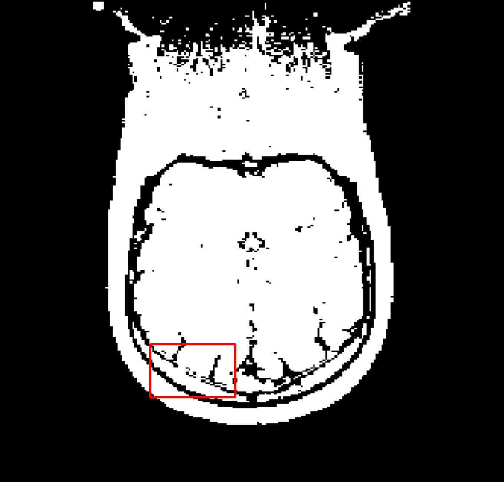

# HMIN318M Imagerie Médicale et 3D
*Noé Masse, 27/09/2020*

## Segmentation

Notre objectif va être d'implémenter un algorithme de segmentation appelé *Bridge Burner*, proposé par *A. Mikheev, H. Rusinek et R. Grossman*.

Le principe est le suivant :
* Binariser l'image
* Eroder l'image avec plusieurs passes
* Dilater l'image sur les pixels érodé

Pour plus d'information sur les opérateurs morphologique, voir :  
*"Image analysis using mathematical morphology", R. M. Haralick, S. R. Sternberg, and X. Zhuang, IEEE*

Vous pouvez aussi jeter un oeil à un travail similaire réalisé sur des [empreintes digitales 🔗](https://noe.masse.pro/files/Fingerprint-Presentation.pdf) (Slide 21).

## Analyse d'un cerveau

On possède l'acquisition d'un cerveau, et on utilise [Fiji 🔗](https://fiji.sc/) afin de l'analyser.

| Original | Binarized (Otsu) |
|-|-|
| | |

| Histogramme |
|-|
|  |

### Seuillage automatique

Afin de binariser l'image, on utilise la [Méthode d'Otsu 🔗](https://fr.wikipedia.org/wiki/M%C3%A9thode_d%27Otsu).  
Celle ci nous deux classes de manière à minimiser les variances.  
Pour l'image 3D Coronal, on obtient un seuil de **36**.

Cependant, cela ne suffit pas, en effet, si on observe bien, on peut voir des connections entre les différentes parties.

C'est là qu'intervient l'algorithme *Bridge Burner*.

## Implémentation

