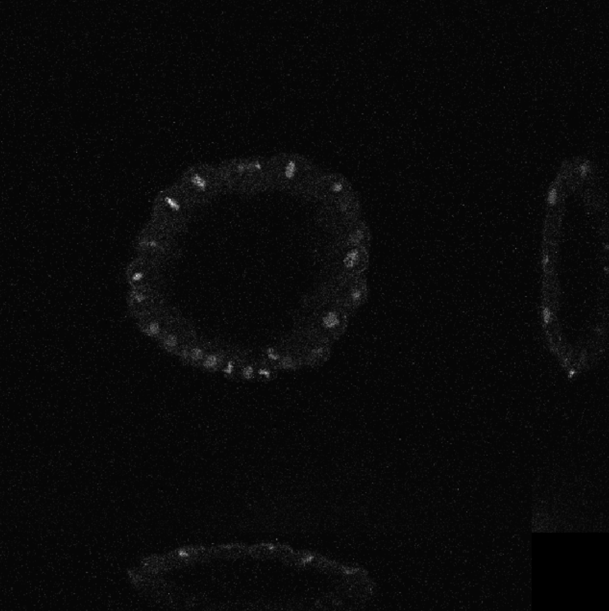
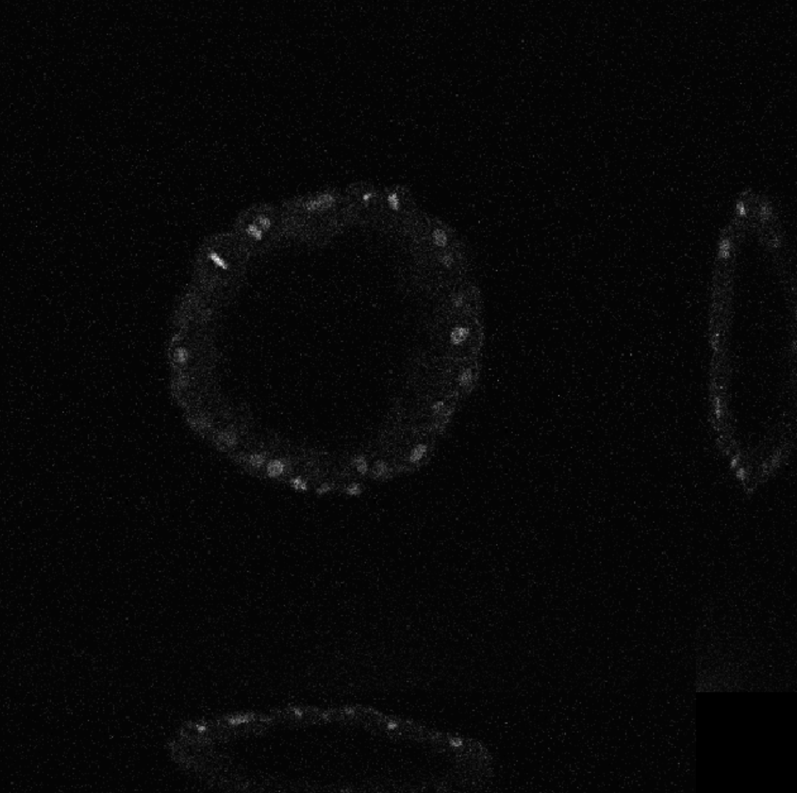
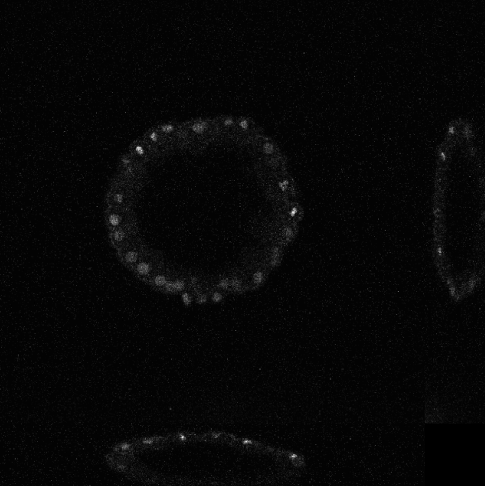
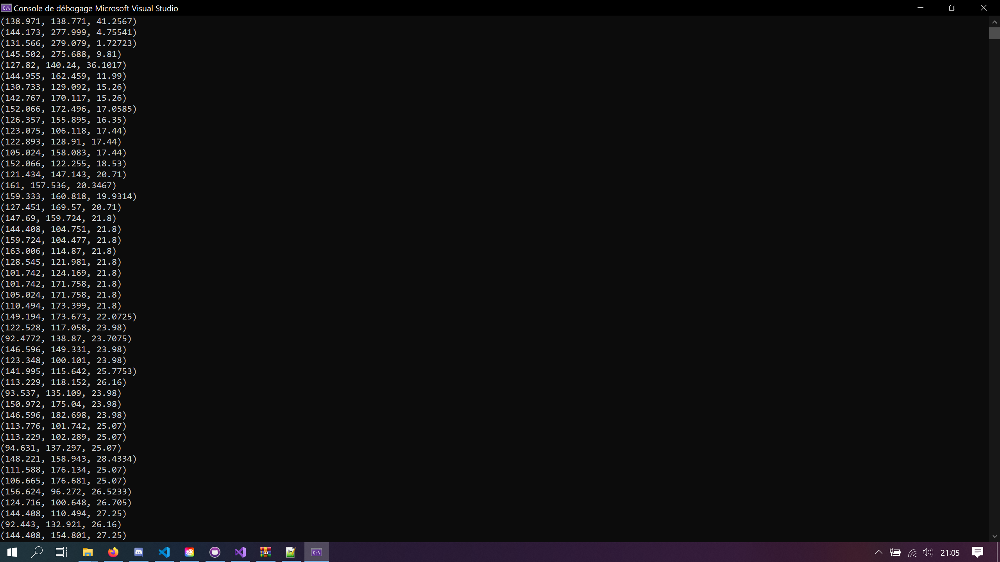

# HMIN318M - Imagerie médicale et 3D

*Noé Masse, 10/2020*

## Imagerie 4D

On s'intéresse à l'imagerie en 4D, c'est à dire une visualisation 3D avec la dimension temporelle.

Pour se faire, on dispose d'une séquence d'images 3D.

### Lecture d'une séquence d'image

Chaque image est un fichier à part entière.
Il faut donc les charger un à un.

`./tp3 <image_name> <image_count>`

```C++
unsigned int imageCount = atoi(argv[2]);

std::vector<CImg<unsigned short>> images(imageCount);
float voxelsize[3];

// Load Images
for (unsigned int i = 0; i < imageCount; i++)
{
    std::stringstream name;
    name << argv[1] << "-" << i << ".img";
    images[i].load_analyze(name.str().c_str(), voxelsize);
}

// Get the dimension of the first image.
// We assume that every image have the same dimension.
int dim[] = { images[0].width(), images[0].height(), images[0].depth() };
```

#### 3 premières images
  

### Cellules d'une image

On s'intéresse pour chaque image, à identifier les différentes cellules de celui ci.
Notre but va être de calculer le barycentre de chacune des cellules pour par la suite, pouvoir suivre leur évoluton.

Rappel de la méthode:
- Enlever le bruit à l'aide d'un filtre médian
- Binariser l'image à l'aide de la méthode d'Otsu
- Appliquer un *Morphological Openning* afin de déconnecter les aspérités.
- Tracer la carte des connectivités

Une fois ceci fait, on peut calculer le barycentre des cellules.

```C++

void ComputeCellBarycenters(
    CImg<unsigned short>& image,
    const std::array<float, 3> &voxelSize,
    std::vector<Vec3> &barycenters
)
{
    // Apply a median filter to remove noise
    image.blur_median(3);
    // Automatically threshold with Otsu method
    // (Implemented in TP 2)
    image.threshold(GetOtsuThreshold(image));

    // Apply morphological opening to remove bridges
    image.erode(3);
    image.dilate(3);

    // Get connected components
    auto labels = image.get_label();

    barycenters.resize(labels.max() + 1, Vec3());
    std::vector<unsigned int> barycenterCounts(barycenters.size(), 0);

    // Compute barycenters
    cimg_forXYZ(labels, x, y, z)
    {
        auto label = labels(x, y, z);
        barycenterCounts[label]++;
        barycenters[label].x += x * voxelSize[0];
        barycenters[label].y += y * voxelSize[1];
        barycenters[label].z += z * voxelSize[2];
    }

    for (int i = 0; i < barycenters.size(); i++)
    {
        unsigned int count = barycenterCounts[i];
        if (count > 0)
        {
            barycenters[i].x /= count;
            barycenters[i].y /= count;
            barycenters[i].z /= count;
        }
    }
}
```

#### Résultats pour la première image



Les valeurs sont cohérente, pour le vérifier on utilise la fonction display et on observe la position des barycentres.

### Evolution des cellules au fil du temps

On s'intéresse à la visualisation des mouvements des cellules. 
Pour se faire, calcul les correspondances entre deux images.
Un algorithme du plus proche voisin devrait fonctionner.

Pour aller plus loin, on pourrait essayer de faire les correspondances en comparant aussi les normes L1 et L2 de chaque cellules. Mais je ne sais pas si cela est plus intéressant que la méthode des moindre carrés.

Une fois les correspondances calculées, on peut tracer les lignes représentant les position des barycentres au fil du temps.

