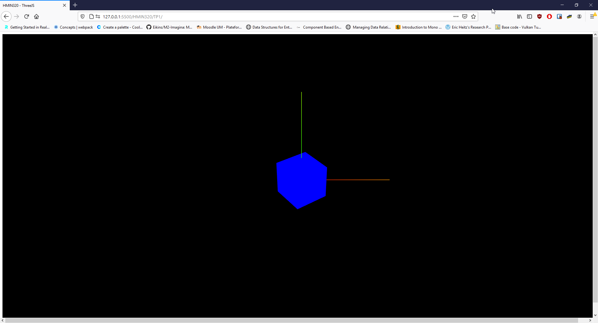
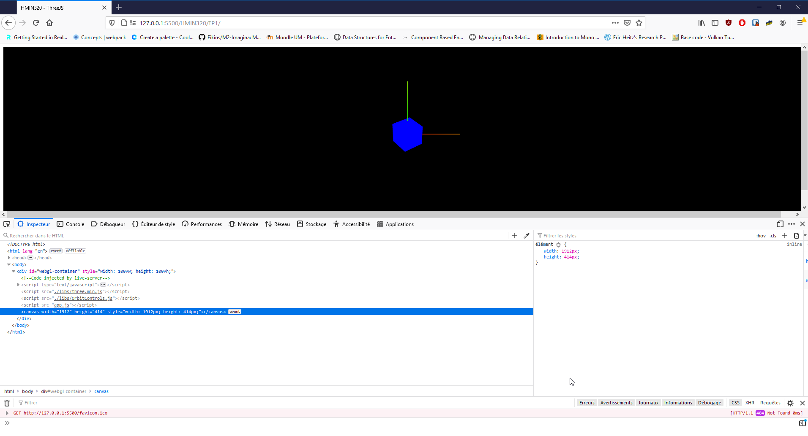
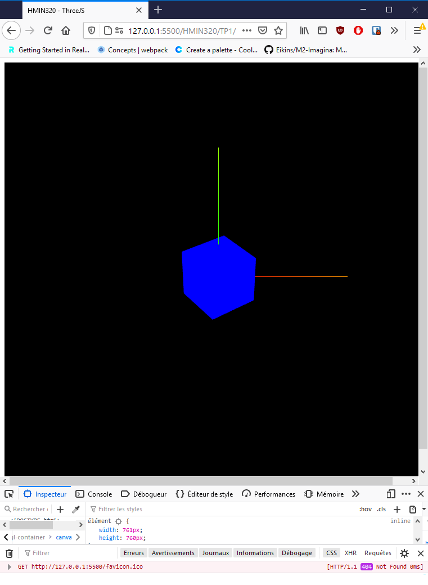
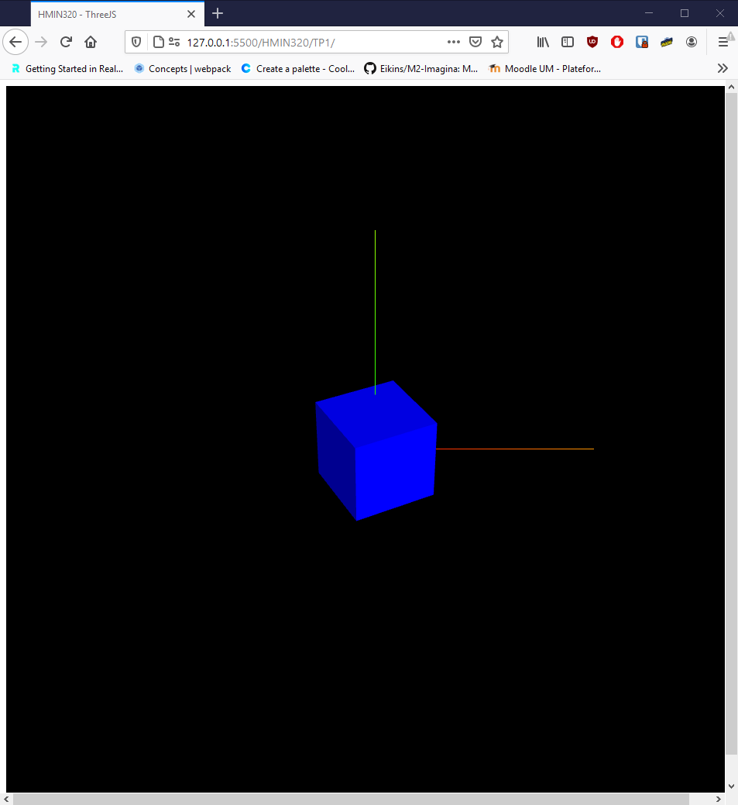
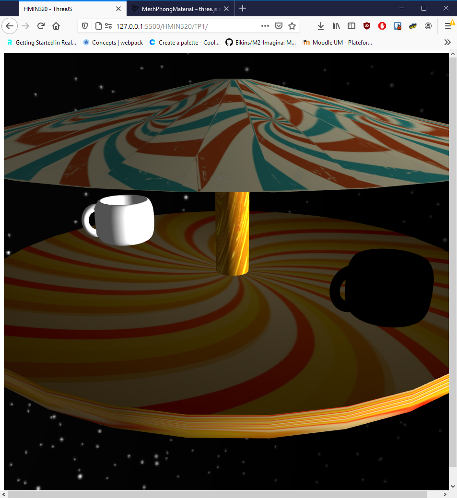

# HMIN320 Vision, réalités virtuelle et augmentée

## Three.JS

*Note : J'avais déjà utilisé Three.JS, notamment pour mon site ([noe.masse.pro](https://noe.masse.pro/) 🔗).*

## Résultats

### Resize

| Taille normale | Large | Fin |
|-|-|-|
|||

#### Remarque

Il est préféranle de ne pas utiliser la propriété `window`, cela ne marche que dans le cas où le canvas prend tout l'écran.

On peut à la place contenir notre rendu dans un **container**
```HTML
    <div id="webgl-container" style="width: 100vw; height: 100vh;"></div>
```
On ajoute un Observer sur le **container**
```JavaScript
function onContainerResize() {
    let parent = renderer.domElement.parentElement;
    let width = parent.clientWidth;
    let height = parent.clientHeight;

    camera.aspect = width / height;
    camera.updateProjectionMatrix();
    renderer.setSize(width, height);
}

...

renderer = new THREE.WebGLRenderer({
    antialias: true
});
renderer.physicallyCorrectLights = true;
renderer.setSize(containerElement.clientWidth, containerElement.clientHeight);

// Attach a resize observer on the container
new ResizeObserver(onContainerResize).observe(containerElement);
containerElement.appendChild(renderer.domElement);
```

### Rotation


### Modèle de Phong



### Carousel



### Résultat final


#### Remarque

On peut utiliser directement une cubemap en tant que skybox.

```JavaScript
scene.background = new THREE.CubeTextureLoader().load([
    "textures/cube/posx.jpg",
    "textures/cube/negx.jpg",
    "textures/cube/posy.jpg",
    "textures/cube/negy.jpg",
    "textures/cube/posz.jpg",
    "textures/cube/negz.jpg",
]);
```