# HMIN320 Vision, réalités virtuelle et augmentée

## Environnement

Afin de créer l'environnement pour notre personnage, j'ai décidé d'utiliser le package **ProBuilder** au lieu d'utiliser un terrain.
Celui ci permet de prototyper des niveaux très facilement en fournissant plusieurs outils pour générer
de la géométrie.
Cela permet aux level designers de fabriquer les niveaux, derrière lesquels les environnement artist pourront travailler pour y ajouter les décors visuels.

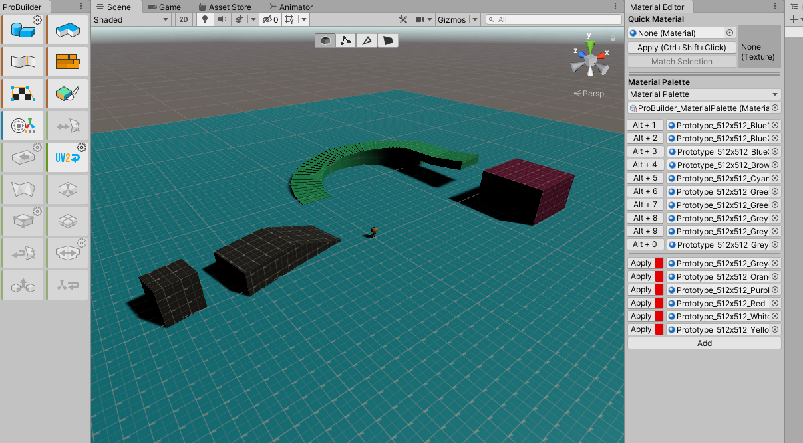

*J'utilise ici des textures de prototyping (GridBox Prototype).*

## Illumination

Pour avoir un rendu plus sympathique, on change la skybox par défaut d'unity et on génère les lightmaps.

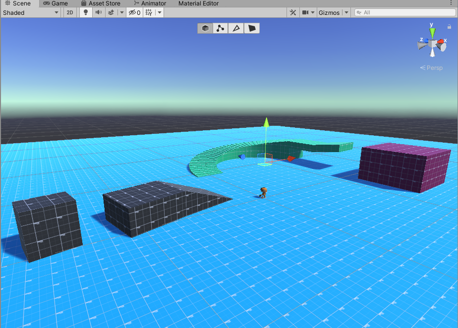

*La skybox est bien différente, j'ai utilisé une des différentes fournies par GridBox Prototype.*

## Joueur

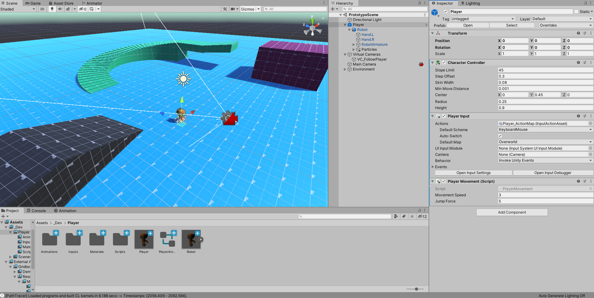

### Gestion des Inputs

Pour contrôler notre personnage, on utilise le nouveaux package **Input System**.
Pour cela, on définit une *Carte d'Actions*

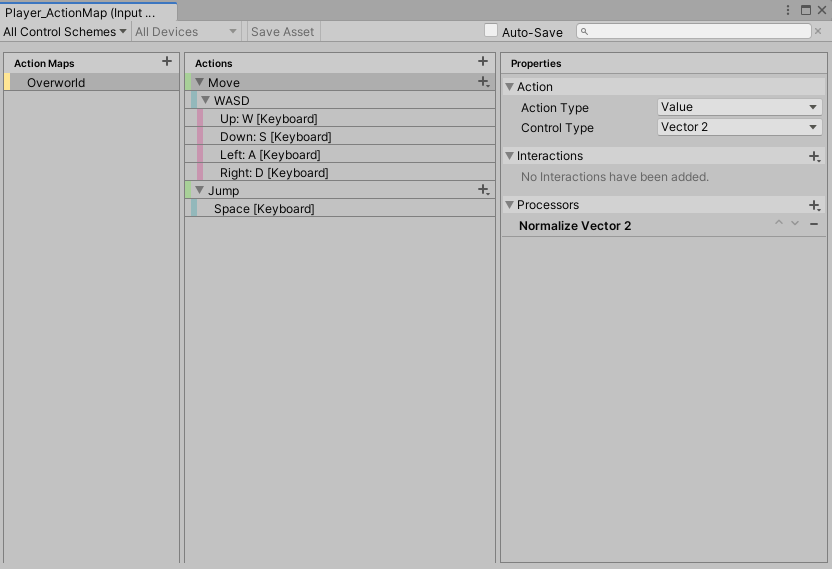

Ensuite, on ajoute le component **Player Input** à notre joueur et on le configure en utilisant des *Unity Events*.

*La transmission ne doit surtout pas se faire en mode SendMessage ou Broadcast message dans un environnement de production !*

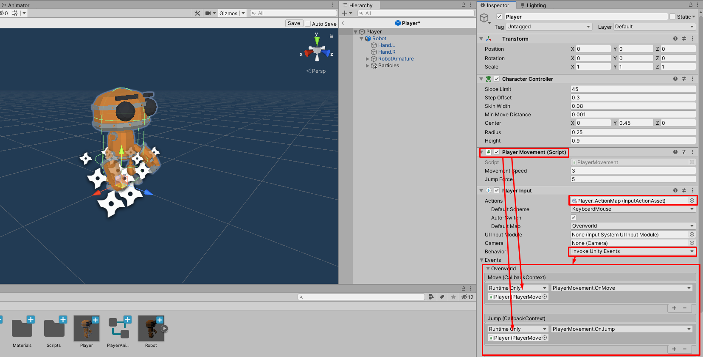

### Mouvements

Afin de déplacer notre joueur, on utilise un **CharacterController** et on implémente notre propre physique pour le joueur.

Voici une version très simplifiée:
#### __PlayerMovement.cs__
```CSharp
namespace Bot320.Gameplay.Player
{
	[RequireComponent(typeof(CharacterController))]
	public class PlayerMovement : MonoBehaviour
	{
		#region Components
		private CharacterController _Controller = null;
		private Animator _Animator = null;
		#endregion

		#region Fields
		[SerializeField] private float _movementSpeed = 1.0f;
		[SerializeField] private float _jumpForce = 5.0f;

		private Vector2 _inputMovement = Vector2.zero;
		private float _verticalSpeed = 0f;
		#endregion

		void Start()
		{
			_Controller = GetComponent<CharacterController>();
			_Animator = GetComponentInChildren<Animator>();
		}

		void FixedUpdate()
		{
			Move();
		}

		private void Move()
		{
            // Input Movement is already normalized in the ActionMap
            // using a Normalize Vector Processor
			var horizontalSpeed = _inputMovement * _movementSpeed;

			if (!_Controller.isGrounded)
			{
				_verticalSpeed -= Physics.gravity.magnitude * Time.fixedDeltaTime;
			}
			else if (_verticalSpeed < 0.0f)
			{
				_verticalSpeed = 0.0f;
			}

			var speed = new Vector3(
				horizontalSpeed.x,
				_verticalSpeed,
				horizontalSpeed.y
			);

            // Integrate the physics here
            // dx = v * dt
			_Controller.Move(speed * Time.fixedDeltaTime);
			_Animator.SetFloat("Speed", horizontalSpeed.magnitude);

			if (horizontalSpeed.sqrMagnitude > 0.1f)
			{
				transform.forward = new Vector3(
					horizontalSpeed.x,
					0,
					horizontalSpeed.y
				);
			}

		}

		#region Input Events
        // Called from the PlayerInput Component

		public void OnMove(InputAction.CallbackContext ctx)
		{
			_inputMovement = ctx.ReadValue<Vector2>();
		}

		public void OnJump(InputAction.CallbackContext ctx)
		{
			if (_Controller.isGrounded)
			{
				_verticalSpeed = _jumpForce;
			}
		}
		#endregion
	}
}
```

### Particules

Pour donner un peu d'interaction entre le joueur et son environnement,
on ajoute des particules lorsque celui ci cours sur le sol.
Pour se faire, on ajoute des particule systems sur ses pieds, et on utilise les *Animation Events* lors de la frame correspondante.

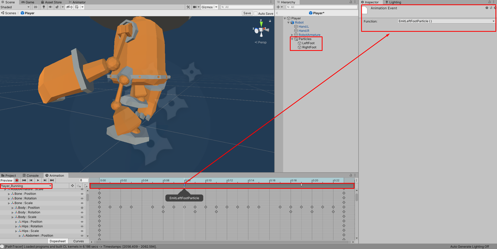  
<br>


## Collectables

On créer ensuite notre prefab **Coin**.  
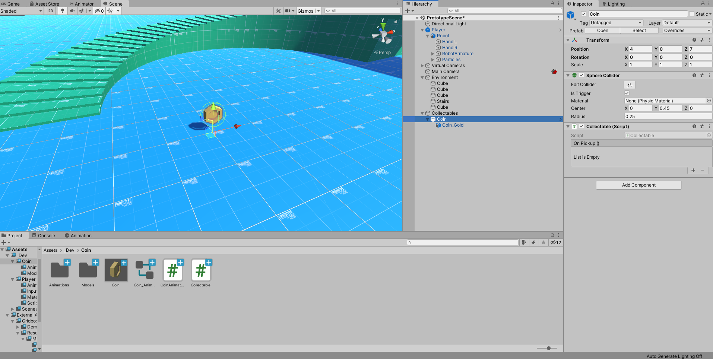

### Animations

Pour donner de la vie à la scène et une interaction, on créer deux simples animations pour les pièces : *Idle* et *Pickup*.
L'animation *Pickup* détruira automatiquement la pièce uen fois celle ci terminée.

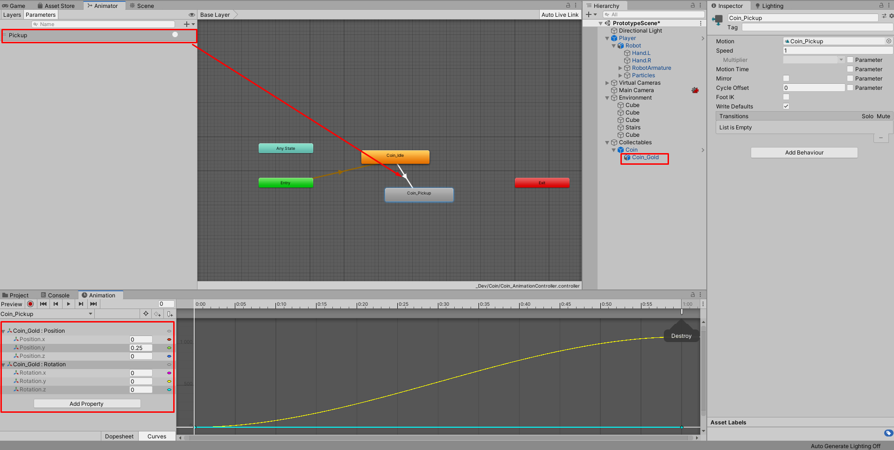

On ajoute ensuite notre collider en mode trigger, avec un script *Collectable*

#### __Collectable.cs__

```CSharp
namespace Bot320.Gameplay.Collectables
{

	public class Collectable : MonoBehaviour
	{

		[SerializeField] UnityEvent _onPickup;
		private Animator _Animator;

		void Start()
		{
			_Animator = GetComponentInChildren<Animator>();
		}

		private void OnTriggerEnter(Collider other)
		{
			if (other.CompareTag("Player") == true)
			{
				if (_Animator)
				{
					_Animator.SetTrigger("Pickup");
				}
				_onPickup.Invoke();
			}
		}
	}
}
```

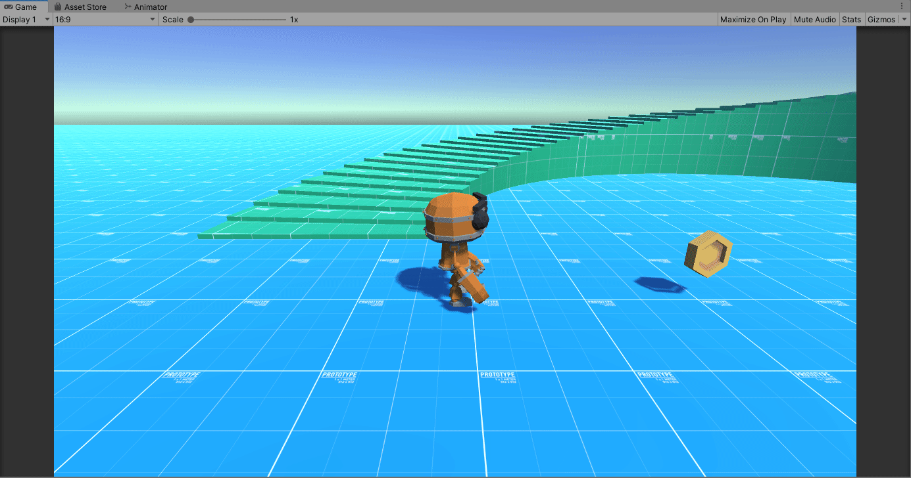

### Son

On ajoute ensuite une AudioSource sur notre pièce, et on utilise notre *Unity Event : On Pickup* pour jouer le son.

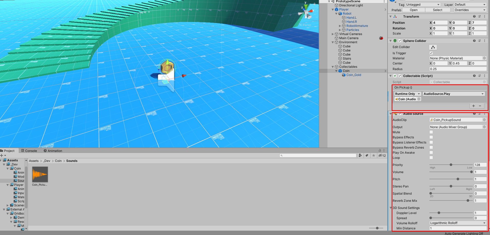

### Score

On ajoute un simple texte sur l'UI, et on lie le tout.  
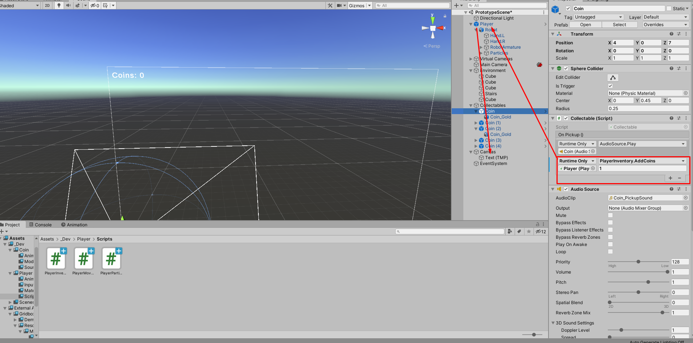

## Conclusion

On a ici la base d'un platformer 3D, dans la suite, on travaillera sur les menus, et on ajoutera des GPE (GamePlay Elements), on peaufinera aussi le joueur (jump animations...) et la physique de celui ci.