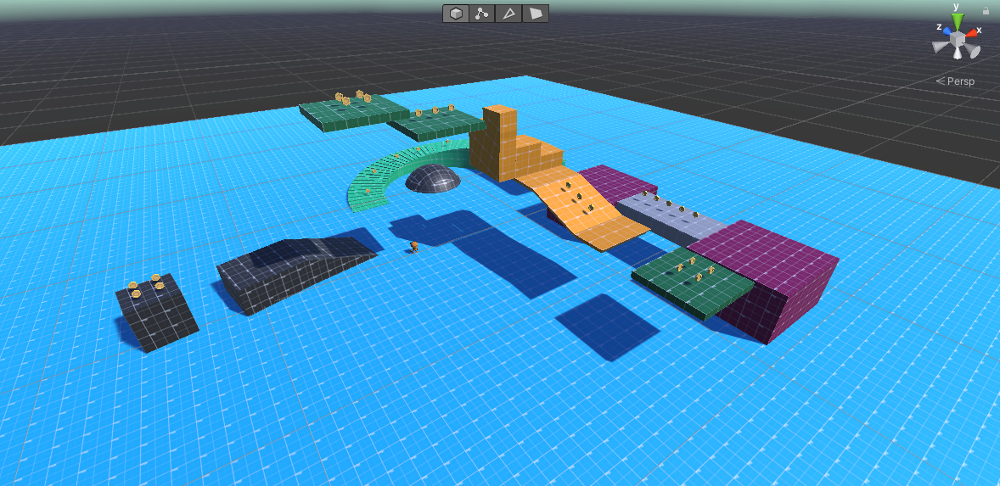
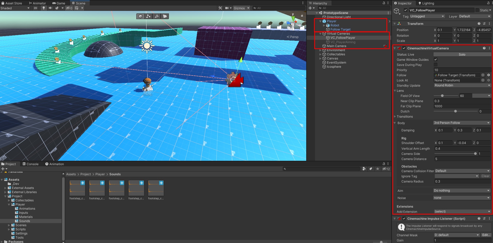
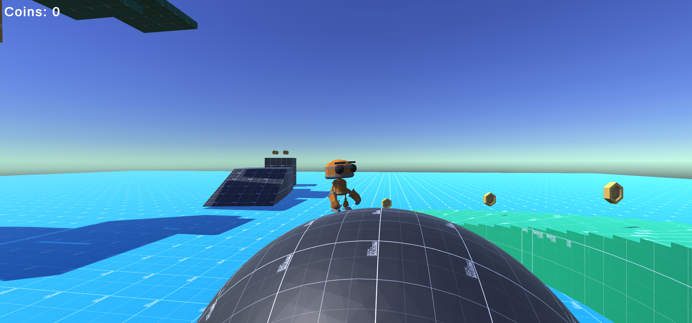
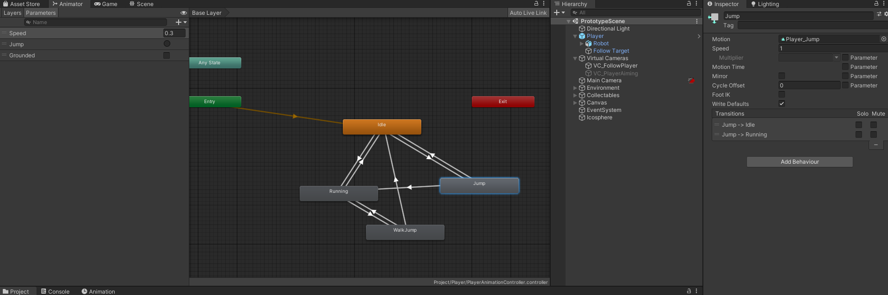
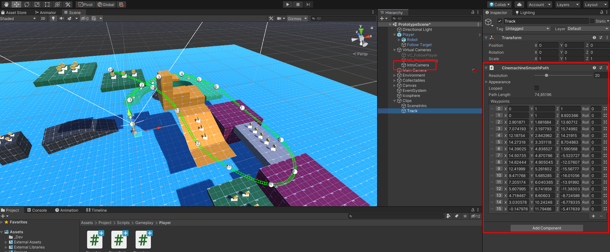
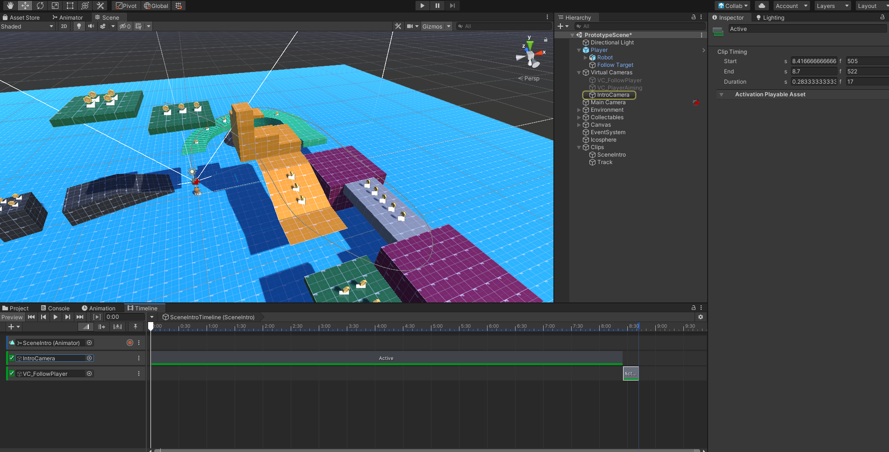

# HMIN320 Vision, réalités virtuelle et augmentée

On reprend la suite du TP1, et on y apporte quelques améliorations.

## Création d'un niveau simple

On utilise probuilder afin de créer un niveau de plateforme à terminer



## Caméra

Pour permettre au joueur de découvrir son environnement, on lui donne un meilleur contrôle sur la caméra à l'aides des *Flèches Directionnelles*.
On utilise la package **Cinémachine** pour la gestion des caméras.

On sépare notre joueur en deux objets : une cible pour la caméra et le corps du joueur.



On attache ensuite notre *Follow Target* à notre caméra virtuelle, et on utilise le mode *3rd Person Follow*.

#### PlayerController.cs
```CSharp
// Input Event
public void OnLookAround(InputAction.CallbackContext ctx)
{
    _inputLookVector = ctx.ReadValue<Vector2>();
}

private void LookAround()
{
    if (_followTransform != null)
    {
        _followTransform.rotation *= Quaternion.AngleAxis(_inputLookVector.x * _lookRotationSpeed.x * Time.fixedDeltaTime, Vector3.up);
        _followTransform.rotation *= Quaternion.AngleAxis(_inputLookVector.y * _lookRotationSpeed.y * Time.fixedDeltaTime, Vector3.right);

        ResetRollAndClampCameraAngles();

        // When the player moves, align him with the camera angle
        if (_localSpeed.x != 0.0f || _localSpeed.z != 0.0f)
        {
            transform.rotation = Quaternion.Euler(0.0f, _followTransform.eulerAngles.y, 0.0f);
            _followTransform.localEulerAngles = new Vector3(angles.x, 0, 0);
        }
    }
}
```

On peu ainsi déplacer librement la caméra autour du joueur.  


### Visée

En préparation d'un éventuel système de visée, on crée une deuxième caméra virtuelle placée au niveau de l'épaule du joueur, et on créer une transition lors du maintiens de la touche de visée ajoutée à l'*ActionMap* : `[Left Shift]`

#### PlayerController.cs
```CSharp
public void OnAim(InputAction.CallbackContext ctx)
{
    if (ctx.started)
    {
        _mainCamera.SetActive(false);
        _aimCamera.SetActive(true);
    }
    else if (ctx.canceled)
    {
        _mainCamera.SetActive(true);
        _aimCamera.SetActive(false);
    }
}
```


## Amélioration du Saut

Dans un premier temps, nous ajoutons les animations de saut.



Ensuite, nous allons revoir la physique du saut.
En effet, actuellement le saut forme une parabole car nous utilisons les lois de la physique classique, cependant, ce n'est pas le plus agréable à manier pour un joueur.  
Une conférence GDC a été donnée sur ce sujet et est très intéressante.


#### PlayerController.cs
```CSharp
_localSpeed.y -= g * dt * (_localSpeed.y < 0.0f ? _fallMultiplier : 1.0f);
```

**GDC Reference** [Building a better jump 🔗](http://www.mathforgameprogrammers.com/gdc2016/GDC2016_Pittman_Kyle_BuildingABetterJump.pdf)

Enfin, on ajoute deux éléments supplémentaires:
- On limite la vitesse de chute, afin de simuler la résistance de l'air et avoir un meilleur contrôle de celles ci
- On ajoute un court délai (~0.1s) qui permet au joueur d'effectuer un saut même après être tombé d'une plateforme

La deuxième solution permet d'éviter les situations frustrantes pour le joueur, où celui ci appuie un peu trop tard en bordure de plateforme et tombe dans le vide.

**Limitation de la vitesse de chute**
```CSharp
_localSpeed.y = Mathf.Max(_localSpeed.y, -_maximumFallSpeed);
```

**Délai pour le saut**
```CSharp
if (!_Controller.isGrounded)
{
    _timeElapsedSinceLastGrounded += dt;
}
else
{
    _timeElapsedSinceLastGrounded = 0.0f;
}
```

```CSharp
public void OnJump(InputAction.CallbackContext ctx)
{
    // We can jump within a short delay after leaving the ground
    if (ctx.started && _timeElapsedSinceLastGrounded < _jumpPermissiveExtraTime)
    {
        _localSpeed.y = _jumpForce;
        _Animator.SetTrigger("Jump");
    }
}
```

## Cinématique d'introduction

On souhaite ajouter une cinématique d'introduction à notre jeu.
Dans un premier temps, on créer une nouvelle *Caméra Virtuelle (Cinémachine)* et on créer un *Cinémachine Smooth Path*
On ajoute le composant *Cinemachine Dolly Cart* à notre caméra virtuelle et on lui mets une vitesse de 10m/s.



Ensuite, on créer une timeline qui se déclenchera dès le début du niveau.
On lui ajoute deux activations tracks : on active dans un premier temps notre caméra d'introduciton, pour on active ensuite celle du joueur.



Et voilà ! On a une superbe cinématique de début de niveau ! Celle ci est très basique mais on peut l'approfondir avec l'outil Timeline en ajoutant divers effets.

*N'hésitez pas à tester le jeu pour voir la cinématique*

## Ajouts supplémentaires
 
Voici une liste de petits ajoûts supplémentaires:
- Correction d'un bug permettant d'obtenir plusieurs pièces d'un coup
- Ajoût des bruits de pas lorsque le joueur cours sur le sol
- Fixation de la vitesse lorsque le joueur est sur le sol, celle ci est calculée de sorte que le joueur puisse descendre les pentes sans accoups.