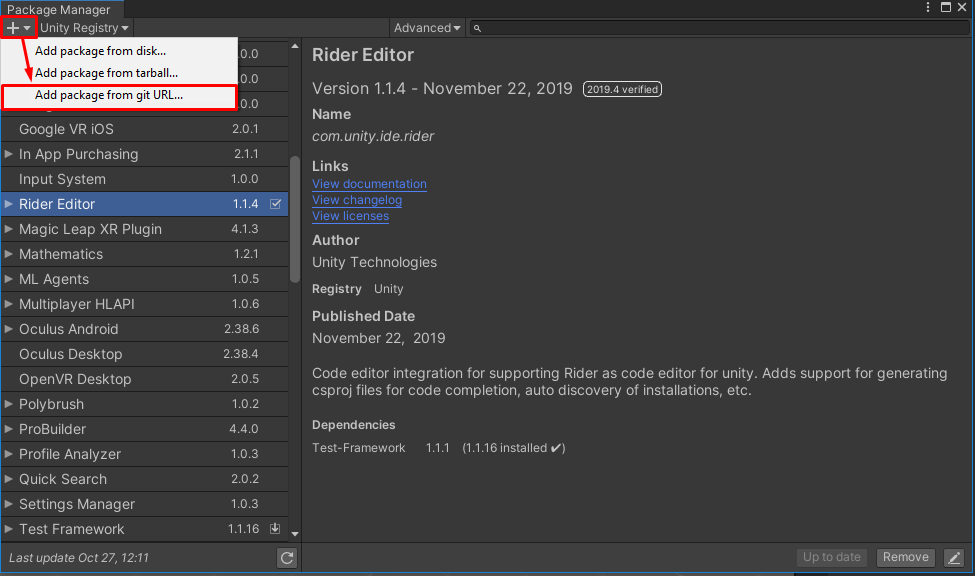
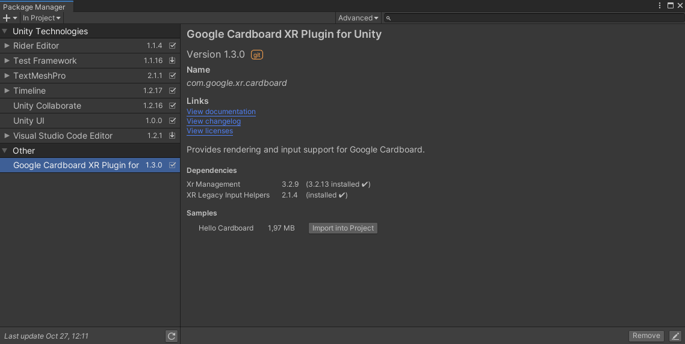
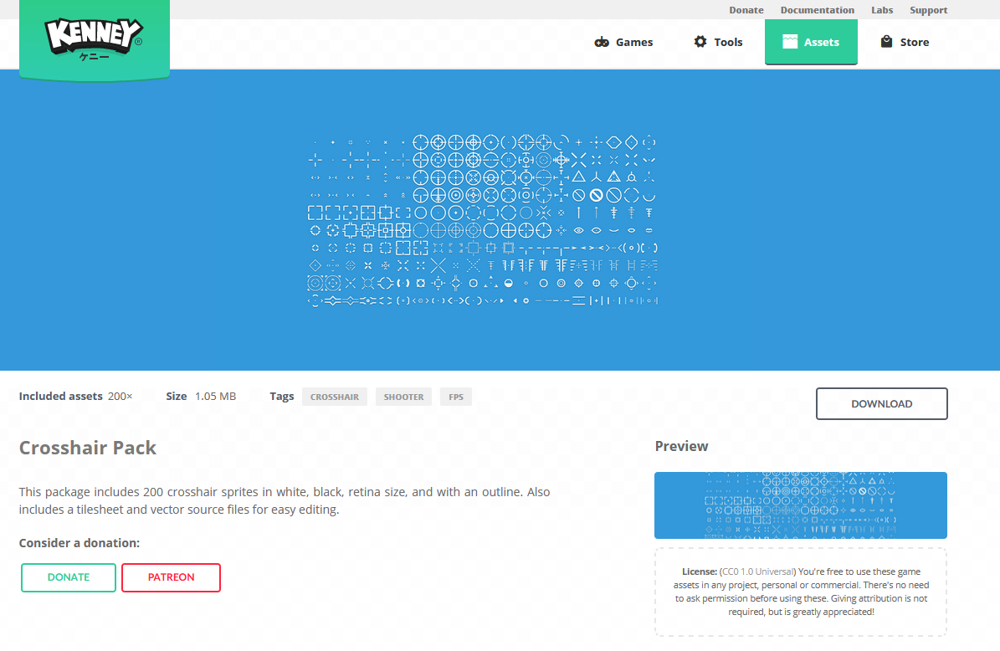
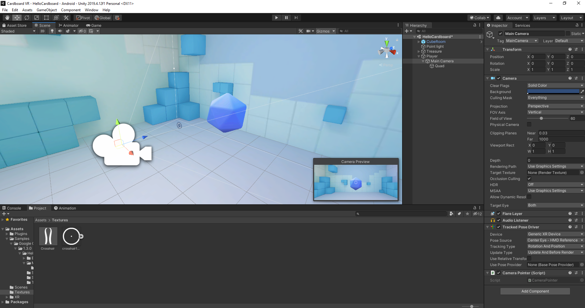
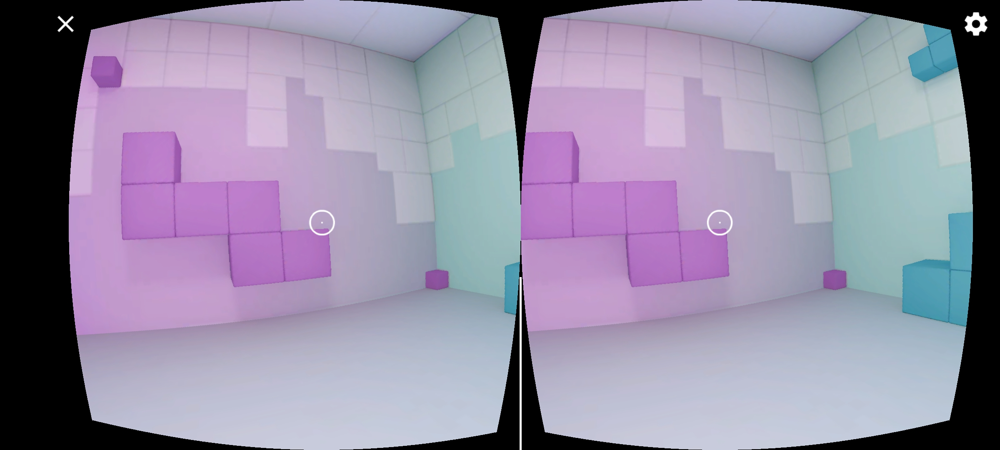
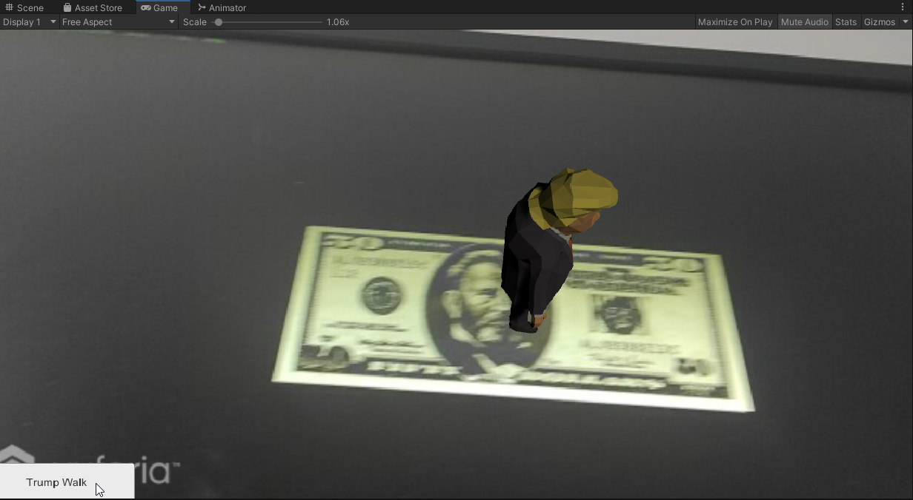
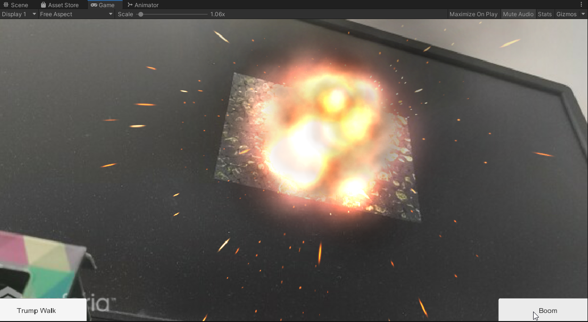

# HMIN320

## Création d'une application XR avec Cardboard SDK

https://developers.google.com/cardboard

### Installation

On utilise le **Package Manager** d'Unity afin d'installer le *Cardboard XR Plugin*.  
On ajoute le package git : `https://github.com/googlevr/cardboard-xr-plugin.git`



On importe ensuite le Hello Cardboard depuis le package.



Celui ci se trouve à l'emplacement  
 `Assets/Samples/Google Cardboard XR Plugin for Unity/1.3.0/Hello Cardboard`

### Configuration du projet

On passe sur la plateforme de développement **Android**.

**File > Build Settings > Android > Switch Platform**

Puis on configure le projet comme indiqué sur le guide de google.

https://developers.google.com/cardboard/develop/unity/quickstart

### Modification de la scène

On attache un script `CameraPointer` sur notre caméra.

*Note : Ce script est adapté d'un exemple fourni par Google, mais nous
permet de comprendre le fonctionnement.*

#### CameraPointer.cs
```CSharp
public class CameraPointer : MonoBehaviour
{
    private const float _maxDistance = 10;
    private GameObject _pointedObject = null;

    public void Update()
    {
        // Casts ray towards camera's forward direction, to detect if a GameObject is being pointed
        // at.
        RaycastHit hit;
        if (Physics.Raycast(transform.position, transform.forward, out hit, _maxDistance))
        {
            // GameObject detected in front of the camera.
            if (_pointedObject != hit.transform.gameObject)
            {
                _pointedObject?.SendMessage("OnPointerExit");
                _pointedObject = hit.transform.gameObject;
                _pointedObject.SendMessage("OnPointerEnter");
            }
        }
        else
        {
            // No GameObject detected in front of the camera.
            _pointedObject?.SendMessage("OnPointerExit");
            _pointedObject = null;
        }

        // Checks for screen touches.
        if (Google.XR.Cardboard.Api.IsTriggerPressed)
        {
            _pointedObject?.SendMessage("OnPointerClick");
        }
    }
}
```

Et on ajoute une interaction simple.
### ObjectController.cs
```CSharp
public void OnPointerEnter()
{
    SetMaterial(true);
}

public void OnPointerExit()
{
    SetMaterial(false);
}

public void OnPointerClick()
{
    TeleportRandomly();
}

private void SetMaterial(bool isPointed)
{
    if (InactiveMaterial != null && PointedMaterial != null)
    {
        _myRenderer.material = isPointed ? PointedMaterial : InactiveMaterial;
    }
}
```

Finalement, pour aider à la visée, on ajoute un viseur en UI.  
Le viseur provient du pack d'assets **Crosshairs - Kenney.nl**

  

<br>



### Résultat



## Création d'une application AR avec Vuforia

On a suivi le tutoriel de Vuforia.
J'ai décidé d'ajouter des FX pour la deuxième image, au lieu d'une animation.

### Résultats

  

<br>

