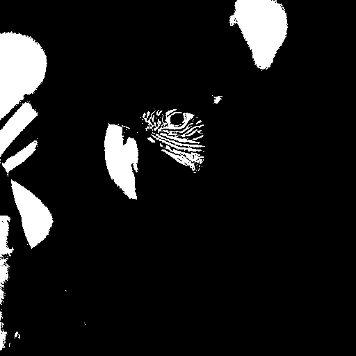
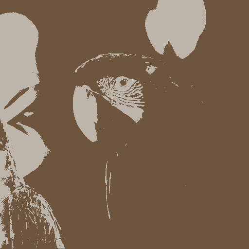
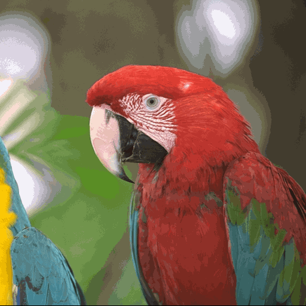
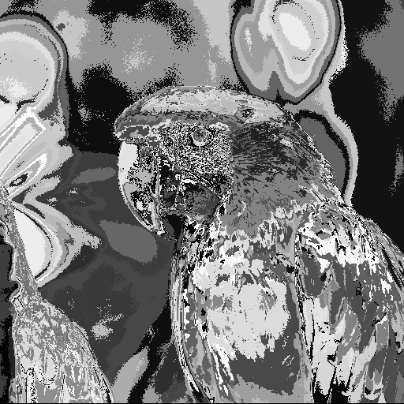
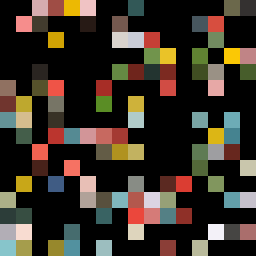
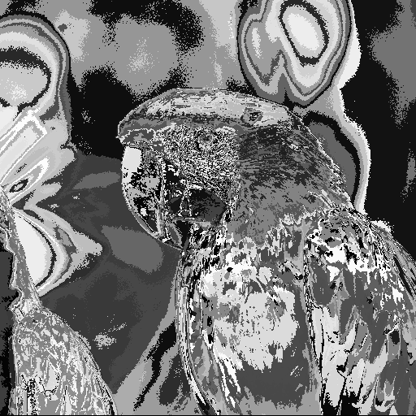
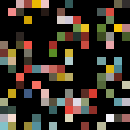

 <!-- title: HMIN322 - Codage et compression multimédia -->

# HMIN322 - Codage et compression multimédia
## Transformation d'une image couleur (16 millions de couleurs) en une image couleur (palette couleurs)

### Objectif

Pour compresser notre image, nous allons étudier une méthode de compression par palette.

L'espace de couleur de notre image initiale est l'espace RGB $C = \llbracket0, 255\rrbracket^3$.

Nous avons notre image $I \in C$, et notre but est de trouver une palette de couleurs $C_n \subset C$ de taille $n$, telle que
$$C_n = \min_{c_n \subset C} |I - \mathbb{P}_{c_n}(I)|$$ 

Où $\mathbb{P}_{c_n}$ est la projection de $I$ dans $c_n$.

Nous noterons $I_n$ la projection de $I$ dans $C_n$
$$I_n = \mathbb{P}_{C_n}(I)$$

Afin de de trouver une bonne approximation de ce résultat, nous allons utiliser l'algorithme [*K-means*🔗](https://en.wikipedia.org/wiki/K-means_clustering).

Pour quantifier notre compression, nous utilisions le [PSNR 🔗](https://en.wikipedia.org/wiki/Peak_signal-to-noise_ratio).

### Résultats

Pour $n = 2$, nous obtenons le résultat suivant après **6 itérations** pour la convergence.

| $I$                      | Initialisation                       | $I_2$ |
|--------------------------|----------------------------------| - |
|  |  |  |
| |  |  |

Pour $n = 256$

Après **3 itérations**, PSNR = 32.547 dB

| Image compressée         | Indices                               |  Palette                        | 
|--------------------------|-----------------------------------------| ---------------------------------|
|  |  |  |

Après **5 itérations**, PSNR = 33.114 dB

| Image compressée         | Indices                               |  Palette                        | 
|--------------------------|-----------------------------------------| ---------------------------------|
|  |  |  |

### Pistes d'amélioration

Dans mon implémentation, j'ai utilisé un algorithme naïf pour trouver le centroïd avec la distance minimale au pixel, cette étape pourrait être optimisée via un algorithme de partitionnement spatiale, comme un [Octree 🔗](https://en.wikipedia.org/wiki/Octree).