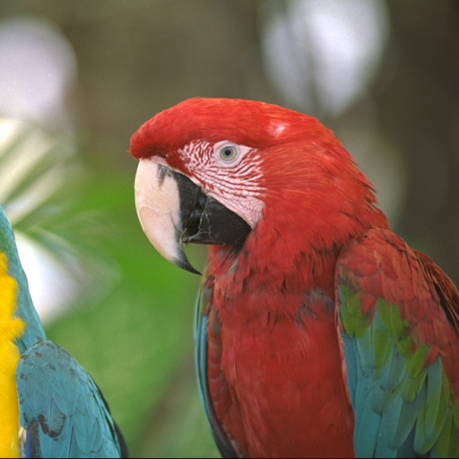

 <!-- title: HMIN322 - Codage et compression multimédia -->

# HMIN322 - Codage et compression multimédia
## Changement d'espace couleur

### Objectif

Afin de compresser une image, nous nous proposons de réduire la taille de certaine de ses composantes.

Nous allons diviser par 4 la taille de 2 des 3 plans de couleur d'une image.

Au total, cela correspond à un taux de compression de 2.

Dans un premier temps, nous allons faire cette opération dans l'espace `RGB`, en choisissant de conserver le plan `G` car il contient le plus d'information visuelle pour le système visuel humain.

Dans un deuxième temps, nous choisirons l'espace [`YCbCr`](https://en.wikipedia.org/wiki/YCbCr) 🔗 car celui ci est basé sur une représentation Luminance / Chromatique, nous effectuons une réduction chromatique, moins perceptible.

Pour quantifier notre compression, nous utilisions le [PSNR](https://en.wikipedia.org/wiki/Peak_signal-to-noise_ratio) 🔗.

### Résultats

Dans le premier cas, nous obtenons un PSNR de 31.7637 dB.  
Ce qui est correct.

| Originale 🐦                | Compressée 🐦                    |
|-----------------------------|-----------------------------------|
|  |  |

En utilisant l'espace `YCbCr`, nous obtenons un PSNR de 38.6724 dB.  
Nous avons une bien meilleure compression !

| Originale 🐦| `YCbCr` 🐦| Compressée 🐦|
|-------------|------------|---------------|
|  |  |  |

Pour le `Chien` 🐕 nous obtenons un PSNR de 41.9413 dB.  
La différence n'est même plus visible à l'oeil nue.

| Originale 🐕| `YCbCr` 🐕| Compressée 🐕|
|-------------|------------|---------------|
|  |  |  |

### Autres méthodes de compression

On pourrait réduire la taille des deux plans en utilisant une interpolation [`Bilinéaire`](https://fr.wikipedia.org/wiki/Interpolation_bilin%C3%A9aire) 🔗 ou [`Bicubique`](https://fr.wikipedia.org/wiki/Interpolation_bicubique) 🔗.

Une autre méthode de compression, serait par exemple d'utiliser un [`QuadTree`](https://fr.wikipedia.org/wiki/Quadtree) 🔗 en découpant les zones dont la variance est au dessus d'un certain seuil.

