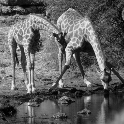
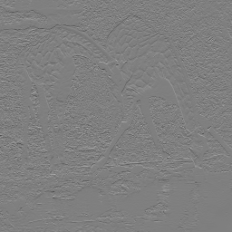
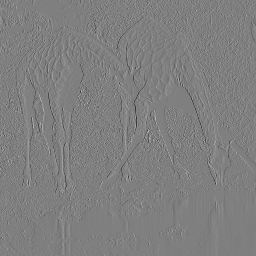
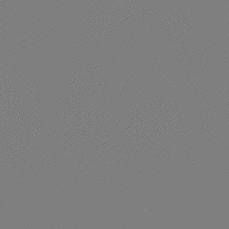
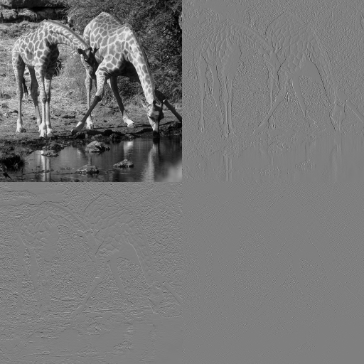
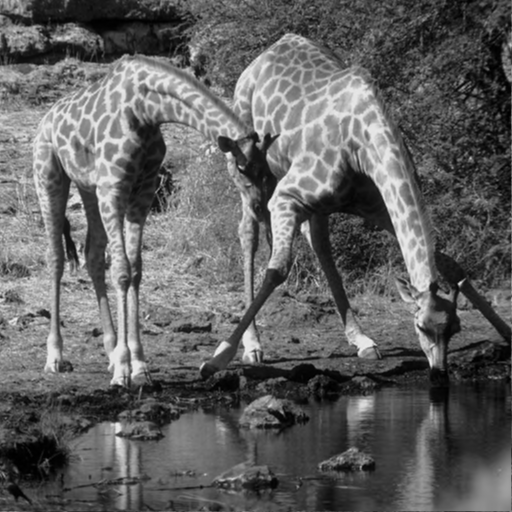
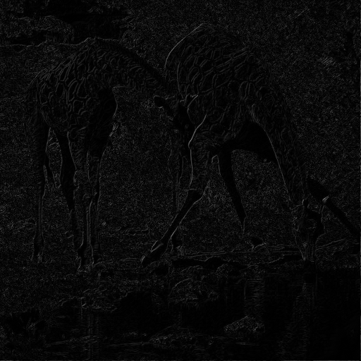
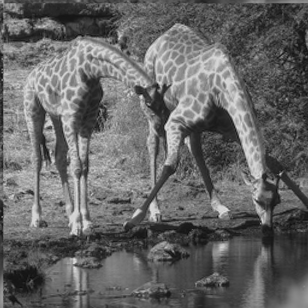
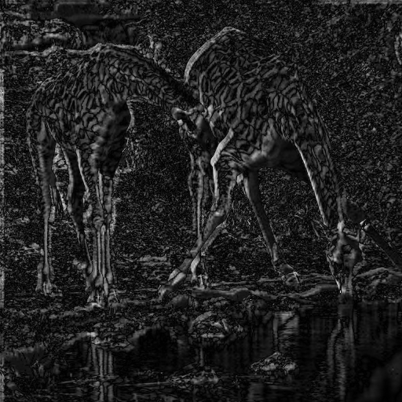

 <!-- title: HMIN322 - Codage et compression multimédia -->

# HMIN322 - Codage et compression multimédia
## Tansformée en ondelette

### Objectif

Nous allons utiliser la [Transformée en ondelette 🔗](https://fr.wikipedia.org/wiki/Ondelette) afin de compresser une image.

Dans le cadre de ce travaux pratique, nous utiliserons une image en niveau de gris.
L'opération peut aisément se généraliser, séparant par plan de couleurs (`RGB` ou `YCbCr`).

## Haar

Dans un premier temps, nous transformons l'image des **Giraffes** à l'aide de l'ondelette de Haar.

#### Coefficients de décomposition
| Passe-Bas  | Passe-Haut |
| ---------- | ---------- |
| [0.5, 0.5] | [-0.5, 0.5] |

#### Coefficients de recomposition
| Passe-Bas  | Passe-Haut |
| ---------- | ---------- |
| [0.5, 0.5] | [0.5, -0.5] |

*Les coefficients sont fournis par [Wavelet Browser : Haar 🔗](http://wavelets.pybytes.com/wavelet/haar/) , **PyWavelet**.  
On les a ici normalisés par rapport à la norme L1*

#### Résultats

Coefficients
| Low->Low | Low->High | High->Low | High->High |
| -------- | --------- | --------- | ---------- |
|  |  |  |  |

  

Compression des coefficients High->High  
  
*Les coefficients sont tous nuls, pour peut donc s'en passer*

| Originale | Compressée | Différence |
| --------- | ---------- | ---------- |
|  |  |  |

**PSNR :** 25.2617 dB, ce qui est plutôt bon

## Sym4

Dans un second temps, nous transformons l'image des **Giraffes** à l'aide de l'ondelette Sym4.

*Les coefficients sont fournis par [Wavelet Browser : Sym4 🔗](http://wavelets.pybytes.com/wavelet/sym4/) , **PyWavelet**.  

#### Coefficiens
  

#### Compressée
 

*Remarque: On voit bien les problèmes aux niveaux des bords.*

#### Erreur


**PSNR :** 15.1815 dB, le résultat n'est pas très bon, mais l'image reste reconnaissable on a pas mal d'erreur sur les bords.

### Analyse multi-résolution

On peut maintenant appliquer cet algorithm de manière récursive sur le niveau de détail **Low->Low**, c'est ce qu'on appelle l'analyse multi-résolution par ondelettes.

*La suite lors de la présentation*

# Annexe - Détails de l'implémentation

### Utilisation
```C++
// Define filters
const vector<double> kHaarLowPass{ 0.5, 0.5 };
const vector<double> kHaarHighPass{ -0.5, 0.5 };

const vector<double> kInverseHaarLowPass{ 0.5, 0.5 };
const vector<double> kInverseHaarHighPass{ 0.5, -0.5 };

// Get the input signal, normalized in [-0.5, 0.5]
vector<double> inputSignal;
ImageDataToNormalizedVector(inputImage, inputSignal);

// Decompose using DWT
array<vector<double>, 4> decomposition;
WaveletDecomposition(inputSignal, decomposition, width, height, kHaarLowPass, kHaarHighPass);

// Set High-High coefficients to 0
decomposition[3].assign(decomposition[3].size(), 0.0);

// Recompose using IDWT
vector<double> recomposedSignal;
WaveletRecomposition(decomposition, recomposedSignal, width, height, kInverseHaarLowPass, kInverseHaarHighPass);

// Compute the PSNR
double psnr = PSNR(inputSignal, recomposedSignal);
```

### Décomposition
```C++
void WaveletDecomposition(const vector<double> &input, array<vector<double>, 4> &output,
	unsigned int width, unsigned int height,
    const vector<double> &lowPassFilter, const vector<double> &highPassFilter)
{
	array<vector<double>, 2> doubleBuffer;

	// LL | HL
	// ---+---
	// LH | HH
	
	// output => { LL, HL, LH, HH }

	// LOW PASS
	// =====================================================================
	// Horizontal Convolution
	ConvolveWithDownsampling(input, lowPassFilter, doubleBuffer[1]);
	// Transpose for vertical Convolution
	Transpose(doubleBuffer[1], width / 2, height, doubleBuffer[0]);
	// Low-Low
	ConvolveWithDownsampling(doubleBuffer[0], lowPassFilter, doubleBuffer[1]);
	Transpose(doubleBuffer[1], width / 2, height / 2, output[0]);
	// Low-High
	ConvolveWithDownsampling(doubleBuffer[0], highPassFilter, doubleBuffer[1]);
	Transpose(doubleBuffer[1], width / 2, height / 2, output[2]);

	// HIGH PASS
	// =====================================================================
	// Horizontal Convolution
	ConvolveWithDownsampling(input, highPassFilter, doubleBuffer[1]);
	// Transpose for vertical Convolution
	Transpose(doubleBuffer[1], width / 2, height, doubleBuffer[0]);
	// High-Low
	ConvolveWithDownsampling(doubleBuffer[0], lowPassFilter, doubleBuffer[1]);
	Transpose(doubleBuffer[1], width / 2, height / 2, output[1]);
	// High-High
	ConvolveWithDownsampling(doubleBuffer[0], highPassFilter, doubleBuffer[1]);
	Transpose(doubleBuffer[1], width / 2, height / 2, output[3]);
}
```

### Recomposition
```C++
void WaveletRecomposition(const array<vector<double>, 4> &decomposition, vector<double> &output,
	unsigned int width, unsigned int height,
    const vector<double> &lowPassFilter, const vector<double> &highPassFilter)
{
	vector<double> recomposedLow;
	vector<double> recomposedHigh;

	array<vector<double>, 2> doubleBuffer;

	// LL | HL
	// ---+---
	// LH | HH

	// decomposition => { LL, HL, LH, HH }
	
	// LOW PASS RECOMPOSITION
	// =====================================================================
	// Vertical Upsample and convolution
	// LL -> L
	Transpose(decomposition[0], width / 2, height / 2, doubleBuffer[1]);
	Upsample(doubleBuffer[1], doubleBuffer[0]);
	Convolve(doubleBuffer[0], lowPassFilter, recomposedLow);

	// LH -> L
	Transpose(decomposition[2], width / 2, height / 2, doubleBuffer[1]);
	Upsample(doubleBuffer[1], doubleBuffer[0]);
	ConvolveAndAdd(doubleBuffer[0], highPassFilter, recomposedLow);

	// HIGH PASS RECOMPOSITION
	// =====================================================================
	// Vertical Upsample and convolution
	// HL -> H
	Transpose(decomposition[1], width / 2, height / 2, doubleBuffer[1]);
	Upsample(doubleBuffer[1], doubleBuffer[0]);
	Convolve(doubleBuffer[0], lowPassFilter, recomposedHigh);

	// HH -> H
	Transpose(decomposition[3], width / 2, height / 2, doubleBuffer[1]);
	Upsample(doubleBuffer[1], doubleBuffer[0]);
	ConvolveAndAdd(doubleBuffer[0], highPassFilter, recomposedHigh);

	// FINAL RECOMPOSITION
	// =====================================================================
	// Horizontal Upsample and convolution for now
	// Low 
	Transpose(recomposedLow, width, height / 2, doubleBuffer[1]);
	Upsample(doubleBuffer[1], doubleBuffer[0]);
	Convolve(doubleBuffer[0], lowPassFilter, output);

	// Low 
	Transpose(recomposedHigh, width, height / 2, doubleBuffer[1]);
	Upsample(doubleBuffer[1], doubleBuffer[0]);
	ConvolveAndAdd(doubleBuffer[0], highPassFilter, output);
}
```