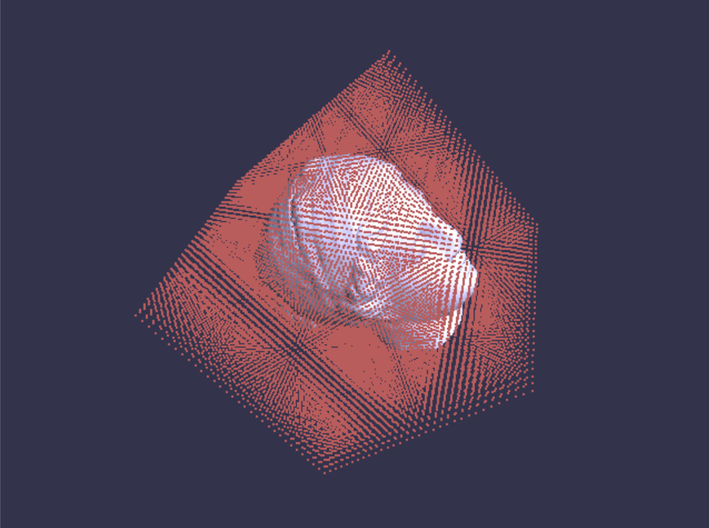
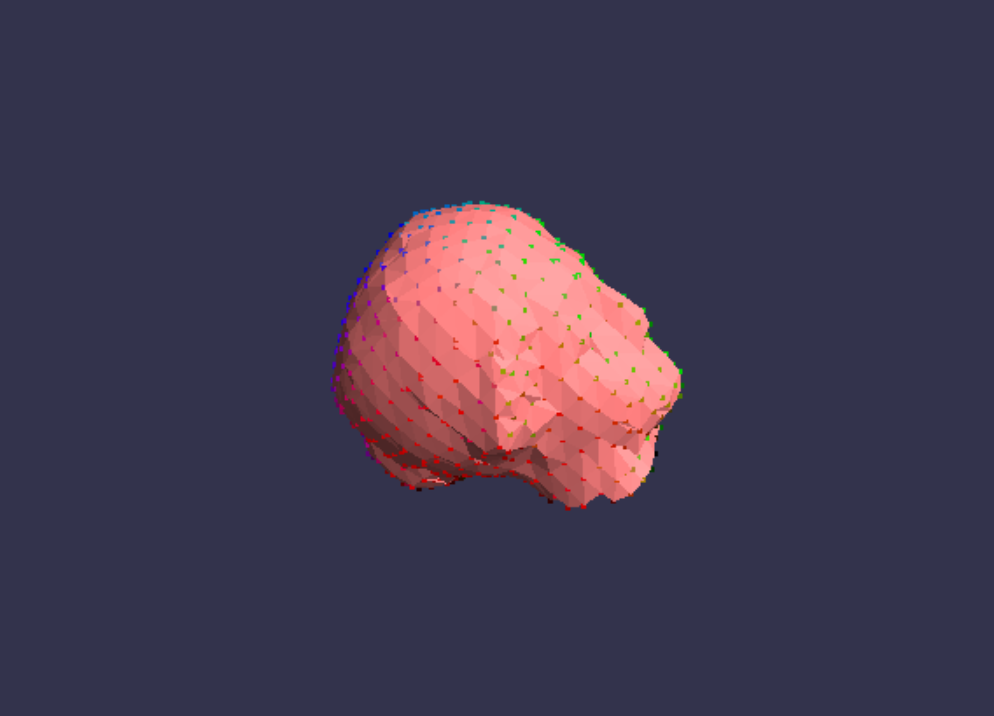
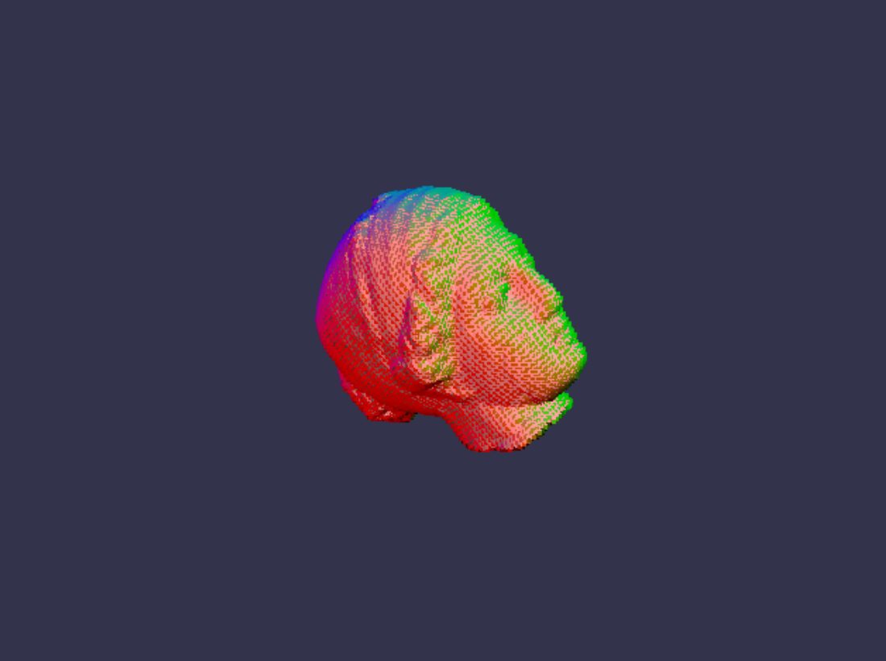

# HMIN323 Informatique Graphique
*Noé Masse, 05/11/2020*

## Avant-propos

Je tiens à m'excuser pour le retard sur le rendu de ce TP.
Ayant oublié de rendre le dernier TP, j'y ai consacré une
partie dans celui-ci, car il est nécessaire pour l'utilisation
du dual contouring.
Je ne parlerai ici que des HPSS, n'ayant pas implémenté les APSS.


## Hermite Point Set Surfaces (HPSS)

Nous avons le problème suivant : nous possédons un ensemble de
points provenant d'une capture, et nous souhaitons extraire une surface
pour diverses traitements.

Ici, nous ne occuperons pas d'enlever les outliers sur les données, mais uniquement
le calcul de la surface.

On utilise l'algorithme HPSS vu dans le cours.
On utilise ici un noyeau gaussien adaptatif i.e. dont le rayon varie localement en
fonction de la distance entre les points.


On peut apercevoir la projection des points, qui se rapproche plutôt bien de la
forme souhaitée. Les points sont agglomérés sur les détails externes, c'est
simplement du au fait que l'ont prend comme ensemble de départ une sphere englobante.

Pour tester la robustesse de notre technique, on décide de bruiter notre ensemble de départ.

 

Ce que l'on observe, c'est que notre HPSS est robuste lorsque les données sont bruitées.

Nous avons donc une fonction qui pour un point quelquonque donné, nous donne sa projection sur la 
surface.

## Signed Distance Field

En traitement graphique, on utilise beaucoup les méthodes *Level Set*.
Le principe est de de définir une surface implicite et algébrique.

Pour avoir plus d'information, on peut définir un champs scalaire correspondant
à la distance signée entre un point et la surface.
Ainsi, le niveau 0 correspond à la surface, les valeurs positifs à l'exterieur de la surface
et les valeurs négatifes à l'intérieur.

Les SDF sont assez utiles, elles permettent certains traitement, Inigo Quilèz possède un blog où
il détail beaucoup les utilisations possibles de celles ci.

https://iquilezles.org/www/index.htm

Pour avoir la SDF, on décide de calculer la distance signée entre le point et le plan de projection de la HPSS.
Ce n'est pas parfait, mais donne une approximation suffisante.

```C++
Vec3::dot(inputPoint - projPos, projNormal);
```

On sample notre HPSS sur une grille



On peut par exemple extraire le volume, en choisissant de garder tous les points donc la valeure est négative


Ou bien extraire la surface.  
Pour se faire, on regarde les 8 coins des cellules de notre grille. Si il y a un changement de signe, alors
on sait qu'un 0 appartient à cette cellule, et on la récupère.


## Dual Contouring

Pour générer un mesh, on utilise l'aglorithme du dual contouring.
Les détails sont dans le code fourni commenté.

Mais grossièrement :
- On effectue une première passe pour recupérer tous les points de la surface et leur vecteur normal.
- On rempli une deuxième grille correspondant aux cellules avec les indices des points (-1 si il n'y a pas de point)
- On effectue une deuxième passe, où on créer des faces lorsqu'une arrête possède 4 voisins.

Dans un premier temps, on ne s'inquiète pas de l'orientation.


*On a ici reprojeté les vertictes sur la surface*

Certains triangles n'ont pas la bonne orientation.
Pour remédier à ce problème, lorsqu'on génère les triangles, on se sert de l'information
des normals des points de la surface pour orienter le triangle correctement.

### Résultats

#### Sans reprojection des vertices


#### Avec Reprojection des vertices (32x32x32)


#### Avec Reprojection des vertices (16x16x16)



#### Avec Reprojection des vertices (64x64x64)




